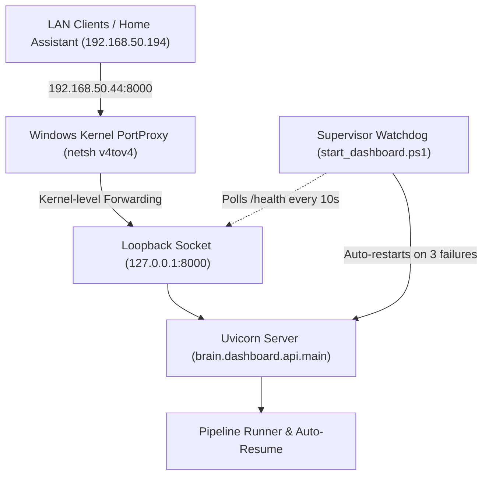

# Socket Resilience & Self-Healing Architecture

This document describes the three-layer resilience architecture designed to keep the Crazy Audiobook Creator dashboard and background pipeline online across network disconnects, interface resets, and router reboots.

---

## 1. The Problem: Windows Winsock Interface Invalidation

When a physical network router reboots or an Ethernet cable/Wi-Fi adapter momentarily loses link state:
- The Windows kernel TCP/IP stack invalidates existing socket descriptors tied to the physical interface IP (e.g. `192.168.50.44`).
- Python's `asyncio` / `uvicorn` event loop continues running internally, but the listening socket on `0.0.0.0:8000` stops accepting new incoming TCP handshakes (`[WinError 10061]` connection refused).
- Upstream reverse proxies (Home Assistant, Nginx Proxy Manager) and web browsers report the service as offline.

---

## 2. The Three Resilience Layers



---

### Layer 1: Native Windows PortProxy Helper (`scripts/setup_portproxy.ps1`)

- **Role**: Absorbs physical network drops at the Windows kernel driver level.
- **Mechanism**:
  - Uses Windows built-in `netsh interface portproxy` to route `0.0.0.0:8000` $\rightarrow$ `127.0.0.1:8000`.
  - When the physical interface resets, the Windows PortProxy driver handles the link reconnection automatically without invalidating loopback sockets.
- **Commands**:
  - **Install PortProxy**:
    ```powershell
    powershell.exe -ExecutionPolicy Bypass -File "scripts\setup_portproxy.ps1"
    ```
  - **Remove PortProxy**:
    ```powershell
    powershell.exe -ExecutionPolicy Bypass -File "scripts\remove_portproxy.ps1"
    ```

---

### Layer 2: Self-Healing Supervisor Watchdog (`scripts/start_dashboard.ps1`)

- **Role**: Automatically detects socket unresponsiveness or unexpected crashes and restarts the server in $<2$ seconds.
- **Mechanism**:
  - Launches the Python dashboard in a monitored child process.
  - Probes `http://127.0.0.1:8000/health` on 10-second intervals.
  - If 3 consecutive probes fail without an intentional user shutdown, the supervisor terminates the stuck PID, frees port 8000, and restarts the process.
- **Manual vs Automatic Shutdown Distinction**:
  - **Intentional Shutdown**: When a user clicks **Shutdown** in the UI (`POST /api/system/shutdown`) or presses `Ctrl+C` in the console, the server creates a `.dashboard_shutdown` sentinel and exits with code `0`. The supervisor detects this and terminates immediately without restarting.
  - **Unplanned Crash / Socket Freeze**: The supervisor triggers automatic recovery only when no shutdown sentinel is present.

---

### Layer 3: In-Flight Pipeline Auto-Resume (`brain/dashboard/api/main.py`)

- **Role**: Guarantees zero lost work across unexpected socket restarts.
- **Mechanism**:
  - On server startup in `lifespan`, if an active pipeline job was in-flight and the restart was unexpected (not a graceful user shutdown), the server automatically re-attaches and resumes the pipeline with `override_schedule=True`.
  - Project state and chapter fingerprints ensure completed chapters are reused instantly from disk.

---

## 3. Verification & Testing

- **Dashboard Health**:
  ```powershell
  curl.exe http://localhost:8000/health
  curl.exe http://192.168.50.44:8000/health
  ```
- **Automated Lifecycle & Security Suite**:
  ```powershell
  venv\Scripts\python.exe -m unittest tests/test_dashboard_lifecycle.py tests/test_dashboard_security.py
  ```
