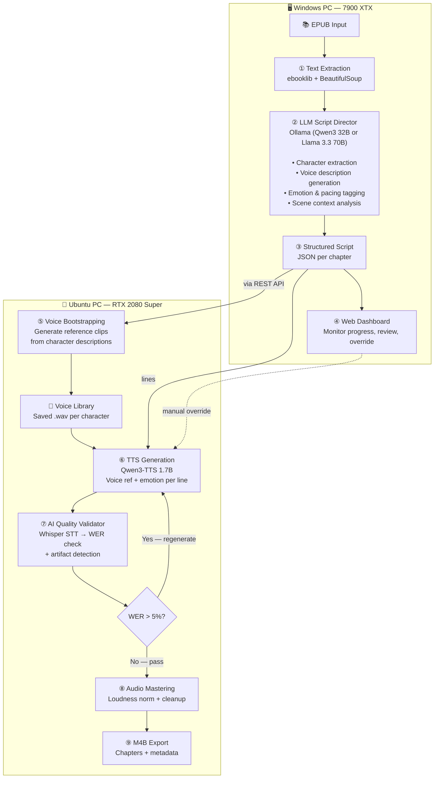

# Crazy Audiobook Creator — Pipeline Design (v2)

A fully local, two-machine audiobook production pipeline that converts fantasy/fiction EPUB books into professional-grade, multi-speaker, emotionally expressive audiobooks — fully automated with AI quality validation.

---

## Changes from v1

Based on your feedback, here are the major revisions:

1. ✅ **Single-engine architecture** — Qwen3-TTS for ALL characters (solves the consistency problem)
2. ✅ **AI Quality Validator** — Whisper transcription + WER check + LLM evaluation
3. ✅ **Fully automated** pipeline with validation loop
4. ✅ **Voice Design** mode — LLM describes characters, Qwen3-TTS generates matching voices
5. ✅ **Fiction/fantasy** focus with heavy character detection
6. ✅ **English only**
7. ✅ **32GB RAM / 75GB storage** confirmed — more than enough

---

## Hardware Architecture

| Machine | GPU | VRAM | RAM | Role |
|---------|-----|------|-----|------|
| **Windows PC** | AMD 7900 XTX | 24 GB | — | **"The Brain"** — LLM for script analysis, character detection, emotion tagging, quality validation |
| **Ubuntu PC** | NVIDIA RTX 2080 Super | 8 GB | 32 GB | **"The Voice"** — Qwen3-TTS 1.7B inference (~6-8GB VRAM) + Whisper validation |

---

## Why Single-Engine (Qwen3-TTS Only)

> [!IMPORTANT]
> You were absolutely right to flag the consistency concern. Here's the revised approach:

**The Problem with Multi-Engine:**
If Character A speaks using Qwen3-TTS and then switches to Chatterbox for an emotional scene, the voice timbre, acoustic characteristics, and "feel" change — even if it's supposed to be the same character. This breaks immersion.

**The Single-Engine Solution:**
Qwen3-TTS 1.7B already supports everything we need in one unified engine:
- **Voice Design**: Create unique voices from text descriptions (e.g., "a deep, gruff male voice, 40s, gravelly, commanding")
- **Emotion Control**: Natural language emotion instructions (e.g., "speak in a desperate, trembling tone")
- **Preset Voices**: Built-in voices like "Serena" (elegant narrator) and "Vivian" (warm conversational)
- **Zero-shot Cloning**: 3-second reference clips for consistent voice reuse

**The Voice Design → Clone Workflow:**
1. LLM analyzes the book and creates voice descriptions for each character
2. Qwen3-TTS Voice Design generates a short reference clip for each character
3. That reference clip is saved to a **voice library**
4. For all subsequent lines by that character, we use the saved clip as reference → **guaranteed consistency**
5. Emotion instructions are applied per-line on top of the consistent voice

This gives us distinct character voices + emotional range + acoustic consistency, all from one engine.

---

## Pipeline Architecture



---

## Detailed Pipeline Stages

### ① Text Extraction (Windows)
- Parse EPUB into clean, chapter-separated text
- Strip formatting artifacts, page numbers, headers/footers, table of contents
- Handle fantasy-specific content: maps, appendices, glossaries (skip or separate)
- Detect chapter boundaries and titles
- **Libraries**: `ebooklib`, `BeautifulSoup4`

### ② LLM Script Director (Windows — Ollama)
This is the "brain" — a powerful local LLM that reads the raw text and produces a structured audiobook script.

**Two-pass analysis with sliding context window:**

**Pass 1 — Character & World Analysis** (runs once per book)
- Read the full book (or summary of each chapter)
- Extract all characters with descriptions, gender, personality traits
- Generate a **voice description** for each character fitting their persona
- Identify the narrator's voice style
- Output: Character registry JSON

**Pass 2 — Line-by-Line Script Generation** (runs per chapter)
- Process each paragraph/sentence with a **10-paragraph context window**
- For each line, determine:
  - `speaker_id` — who is speaking (narrator vs character)
  - `emotion` — emotional state based on surrounding context
  - `speed` — delivery speed (0.8x–1.2x)
  - `pause_before_ms` / `pause_after_ms`
  - `emphasis_words` — key words to stress
- Output: Structured script JSON per chapter

**Example output:**
```json
{
  "book": {
    "title": "The Name of the Wind",
    "author": "Patrick Rothfuss"
  },
  "characters": {
    "narrator": {
      "voice_description": "A warm, mature male voice, early 40s, measured pace, with a storyteller's cadence. Slight baritone, thoughtful pauses between phrases.",
      "gender": "male"
    },
    "kvothe": {
      "voice_description": "A young male voice, late teens to early 20s, quick and clever-sounding, with a slightly musical quality. Confident but sometimes vulnerable.",
      "gender": "male"
    },
    "denna": {
      "voice_description": "A young female voice, early 20s, melodic and slightly teasing. Warm but with an undercurrent of mystery.",
      "gender": "female"
    }
  },
  "chapters": [
    {
      "number": 1,
      "title": "A Place for Demons",
      "lines": [
        {
          "speaker": "narrator",
          "text": "It was night again. The Waystone Inn lay in silence, and it was a silence of three parts.",
          "emotion": "contemplative, somber",
          "speed": 0.85,
          "pause_after_ms": 1200
        },
        {
          "speaker": "kvothe",
          "text": "You should be careful what questions you ask, Chronicler.",
          "emotion": "warning, quiet intensity",
          "speed": 0.9,
          "pause_before_ms": 500
        }
      ]
    }
  ]
}
```

### ③ Voice Bootstrapping (Ubuntu)
- For each character, send their `voice_description` to Qwen3-TTS **VoiceDesign** mode
- Generate a 10-second reference clip
- Save to the **Voice Library** (per-project folder of `.wav` files)
- These clips are reused for every line by that character → **consistency guaranteed**
- If a generated voice doesn't sound right, the system can regenerate with a tweaked description

### ④ TTS Generation (Ubuntu — Qwen3-TTS 1.7B)
For each line in the script:
1. Load the character's reference clip from the Voice Library
2. Apply per-line emotion instruction (e.g., `"speak in a desperate, trembling tone"`)
3. Apply speed/pacing parameters
4. Generate audio segment
5. Save as numbered `.wav` file

**Qwen3-TTS emotion syntax example:**
```
[Voice Reference: kvothe.wav]
[Instruction: Speak with quiet intensity and a warning undertone, slightly slower than normal]
"You should be careful what questions you ask, Chronicler."
```

### ⑤ AI Quality Validator (Ubuntu)
This is the automated QA stage — no human needed.

**Three-layer validation:**

| Check | Tool | Pass Criteria |
|-------|------|---------------|
| **Intelligibility** | Whisper Large-v3 STT → compare transcript to original text | WER < 5% |
| **Audio Artifacts** | Signal analysis (clipping, silence gaps, noise floor) | No clipping, noise < -50dB |
| **Duration Sanity** | Compare expected vs actual duration | Within ±30% of expected |

**Validation loop:**
- If a segment fails WER check → **regenerate with same parameters** (TTS is non-deterministic, retry often fixes it)
- After 3 failed retries → flag for manual review but continue pipeline
- Log all quality scores for post-run analysis

**Libraries**: `faster-whisper` (GPU-accelerated), `jiwer` (WER calculation), `numpy`/`scipy` (signal analysis)

> [!TIP]
> Whisper Large-v3 runs fine alongside Qwen3-TTS on 8GB VRAM since we can validate segments *after* generating them (sequential, not concurrent). Alternatively, we can use `faster-whisper` with the `medium` model (~2GB) for concurrent validation.

### ⑥ Audio Mastering (Ubuntu)
- Concatenate segments per chapter with configured silence gaps
- Cross-fade between segments (25-50ms) for smooth transitions
- LUFS loudness normalization to audiobook standard (-18 to -20 LUFS)
- Noise gate to clean up low-level noise between phrases
- Peak limiting to prevent clipping
- **Tools**: FFmpeg, `pyloudnorm`, `pydub`

### ⑦ M4B Export (Ubuntu)
- Merge chapter audio into single M4B file
- Embed chapter markers with titles
- Embed metadata: title, author, narrator, genre, year
- Embed cover art if available
- **Tools**: FFmpeg, `mutagen`

### ⑧ Web Dashboard (Windows)
A monitoring & management UI that runs on the Windows machine:
- **Project manager**: Create new audiobook projects, import EPUBs
- **Pipeline monitor**: Real-time progress (which chapter, which line, ETA)
- **Script viewer**: Color-coded by speaker, with emotion/speed annotations
- **Quality report**: WER scores per segment, flagged segments
- **Voice library**: Listen to character reference clips, regenerate if needed
- **Manual override**: Re-trigger generation for specific segments
- **History**: Past projects with stats

---

## Technology Stack

### Windows (The Brain)
| Component | Technology |
|-----------|-----------|
| LLM Runtime | **Ollama** with Vulkan backend (best AMD experience) |
| LLM Model | **Qwen3 32B Q4_K_M** (~20GB VRAM) — good balance of quality + speed |
| Orchestrator | **Python 3.12+** |
| Web Dashboard | **FastAPI** backend + **vanilla HTML/CSS/JS** frontend |
| EPUB Parsing | `ebooklib`, `BeautifulSoup4` |
| Database | **SQLite** (project state, job queue, quality logs) |

### Ubuntu (The Voice)
| Component | Technology |
|-----------|-----------|
| TTS Engine | **Qwen3-TTS 1.7B** (~6-8GB VRAM) |
| TTS API | **FastAPI** server |
| Quality Validator | **faster-whisper** (medium or large-v3), `jiwer` |
| Audio Processing | **FFmpeg**, `pyloudnorm`, `pydub`, `scipy` |
| GPU Framework | **PyTorch 2.x + CUDA 12.x** |
| Model Management | Direct HuggingFace download, stored in `~/.cache/huggingface` |

### Communication
| Component | Technology |
|-----------|-----------|
| Windows → Ubuntu | REST API over local network |
| Job Queue | SQLite-backed queue (Windows writes, Ubuntu reads) |
| File Transfer | HTTP upload/download (audio files back to Windows) |
| Status Updates | WebSocket (Ubuntu pushes progress to Windows dashboard) |

---

## Storage Estimate

| Item | Size | Notes |
|------|------|-------|
| Qwen3-TTS 1.7B model | ~7 GB | One-time download |
| faster-whisper medium | ~1.5 GB | For validation |
| Ollama + Qwen3 32B Q4 | ~20 GB | On Windows, not Ubuntu |
| Per-book audio (10hrs) | ~5-10 GB | WAV intermediates, ~600MB final M4B |
| Voice library | ~50 MB | Small reference clips |
| **Total Ubuntu disk** | **~15-20 GB** | Fits well within 75GB |

---

## Project Structure

```
crazy-audiobook-creator/
├── README.md
├── docs/
│   ├── setup-windows.md
│   ├── setup-ubuntu.md
│   └── architecture.md
│
├── brain/                          # ← Runs on Windows
│   ├── requirements.txt
│   ├── config.yaml
│   │
│   ├── extractor/                  # Stage ①: Text extraction
│   │   ├── __init__.py
│   │   ├── epub_parser.py
│   │   └── text_cleaner.py
│   │
│   ├── director/                   # Stage ②: LLM script director
│   │   ├── __init__.py
│   │   ├── character_analyzer.py   # Pass 1: Character extraction + voice descriptions
│   │   ├── script_generator.py     # Pass 2: Line-by-line emotion/speaker tagging
│   │   ├── ollama_client.py        # Ollama API wrapper
│   │   └── prompts/
│   │       ├── character_extraction.md
│   │       ├── voice_description.md
│   │       └── script_generation.md
│   │
│   ├── orchestrator/               # Pipeline coordinator
│   │   ├── __init__.py
│   │   ├── pipeline.py             # End-to-end pipeline runner
│   │   ├── job_queue.py            # SQLite job queue
│   │   └── ubuntu_client.py        # REST client for Ubuntu TTS API
│   │
│   ├── dashboard/                  # Stage ⑧: Web UI
│   │   ├── api/
│   │   │   ├── __init__.py
│   │   │   ├── main.py             # FastAPI app
│   │   │   └── routes.py
│   │   └── frontend/
│   │       ├── index.html
│   │       ├── css/
│   │       │   └── styles.css
│   │       └── js/
│   │           ├── app.js
│   │           ├── pipeline.js
│   │           └── script-viewer.js
│   │
│   └── projects/                   # Generated project data
│       └── .gitkeep
│
├── voice/                          # ← Runs on Ubuntu
│   ├── requirements.txt
│   ├── config.yaml
│   │
│   ├── tts_server/                 # Stages ③④: TTS API
│   │   ├── __init__.py
│   │   ├── main.py                 # FastAPI app
│   │   ├── qwen3_engine.py         # Qwen3-TTS wrapper
│   │   ├── voice_designer.py       # Voice bootstrapping from descriptions
│   │   └── voice_library.py        # Manage character voice clips
│   │
│   ├── validator/                  # Stage ⑤: Quality validation
│   │   ├── __init__.py
│   │   ├── whisper_validator.py    # STT + WER check
│   │   ├── audio_analyzer.py      # Artifact detection
│   │   └── validation_loop.py     # Retry logic
│   │
│   ├── mastering/                  # Stages ⑥⑦: Audio post-processing
│   │   ├── __init__.py
│   │   ├── assembler.py            # Concatenation + cross-fade
│   │   ├── normalizer.py           # LUFS normalization
│   │   └── m4b_exporter.py         # M4B packaging
│   │
│   └── voice_library/              # Persistent voice clips
│       └── .gitkeep
│
├── shared/                         # Shared data models
│   ├── __init__.py
│   ├── models.py                   # Pydantic schemas (Script, Character, Line, etc.)
│   └── constants.py
│
└── scripts/                        # Utility scripts
    ├── install-windows.ps1
    └── install-ubuntu.sh
```

---

## Implementation Phases

### Phase 1 — Foundation & Schema (Week 1)
- [ ] Project scaffolding and shared Pydantic models
- [ ] EPUB text extraction with chapter detection
- [ ] Text cleaning for fantasy books (handle appendices, maps, special characters)
- [ ] Ollama API client
- [ ] LLM prompt engineering: character extraction + voice description generation
- [ ] LLM prompt engineering: line-by-line script generation with emotion tagging
- [ ] End-to-end test: EPUB → structured script JSON

### Phase 2 — TTS Server & Voice System (Week 2)
- [ ] Ubuntu FastAPI TTS server
- [ ] Qwen3-TTS 1.7B integration
- [ ] Voice Designer: text description → reference clip generation
- [ ] Voice Library: save/load/manage character clips
- [ ] TTS generation: reference clip + emotion instruction → audio segment
- [ ] End-to-end test: script JSON → audio segments

### Phase 3 — Quality Validation (Week 3)
- [ ] Whisper integration (faster-whisper on GPU)
- [ ] WER calculation pipeline
- [ ] Audio artifact detection (clipping, silence, noise)
- [ ] Validation loop with retry logic
- [ ] Quality logging to SQLite

### Phase 4 — Audio Mastering & Export (Week 3-4)
- [ ] Audio assembly with cross-fading
- [ ] LUFS loudness normalization
- [ ] Noise gate and peak limiting
- [ ] M4B export with chapters and metadata
- [ ] End-to-end test: EPUB → complete M4B audiobook

### Phase 5 — Web Dashboard (Week 4-5)
- [ ] Project management UI
- [ ] Pipeline progress monitor with WebSocket updates
- [ ] Script viewer with speaker color-coding
- [ ] Quality report dashboard
- [ ] Voice library browser
- [ ] Manual override controls

### Phase 6 — Deployment, Polish & End-to-End Test (Week 6)
- [ ] Initialize Git repository and push to GitHub (`https://github.com/NicusorFlorinBaluta/crazy-audiobook-creator`).
- [ ] Safe Ubuntu Deployment: Connect to `192.168.50.180` via SSH (using Python's `paramiko` to handle password auth). 
- [ ] Transfer codebase to the Ubuntu machine.
- [ ] Run the `install-ubuntu.sh` script to set up the `venv` and dependencies on Ubuntu.
- [ ] Start the Voice Server on Ubuntu.
- [ ] Run the end-to-end test on the Windows Brain server using `sample_book.epub`.

---

## User Review Required

> [!WARNING]
> **Docker vs Venv for Ubuntu Server:**
> You suggested running the app in Docker. For the Windows "Brain", Docker is easy. However, for the Ubuntu "Voice" server, Docker requires `nvidia-docker2` (NVIDIA Container Toolkit) to be properly configured on the host to pass the RTX 2080 Super into the container. 
> Because you explicitly warned that the Ubuntu host has other VMs and Docker projects, and I must not make destructive or system-altering changes, **I strongly recommend skipping Docker for the Ubuntu server.** Installing or reconfiguring the NVIDIA Docker runtime could disrupt your existing containers. 
> Instead, I will use the isolated Python `venv` approach we scripted (`install-ubuntu.sh`), which is completely safe, contained in a single directory, and guarantees zero interference with your host system. Is this acceptable?

## Proposed Changes

### Deployment Scripts
#### [NEW] [deploy.py](file:///e:/Projects/crazy-audiobook-creator/scripts/deploy.py)
A Python script using `paramiko` and `scp` to safely SSH into the Ubuntu machine using the password from `.env`, copy the codebase over, and start the Voice Server.

### Git Repository
- Initialize git, commit all files, and push to the provided remote URL.

## Verification Plan

### Automated Tests
```bash
# Unit tests
pytest brain/tests/ -v      # EPUB parsing, script schema, LLM output parsing
pytest voice/tests/ -v      # TTS generation, validation, audio assembly

# Integration test
python -m brain.orchestrator.pipeline --test --book "test_story.epub"
```

### Quality Metrics
| Metric | Target |
|--------|--------|
| Word Error Rate (WER) | < 5% per segment |
| Loudness (LUFS) | -18 to -20 LUFS |
| Noise floor | < -50 dB |
| Peak level | < -1 dBFS |
| Character voice consistency | Same reference clip for all lines |

### Manual Verification
- Generate a short fantasy story (3-5 chapters) end-to-end
- Listen for: voice consistency, emotional range, pacing, audio quality
- Test M4B playback in VLC / Audiobookshelf
- Compare quality against TTS-Story or Alexandria output

---

## Risk Mitigation

| Risk | Mitigation |
|------|-----------|
| Qwen3-TTS voice drift on long text | Use saved reference clips (not regenerated per line) |
| LLM misidentifies speaker | 10-paragraph context window + character registry lookup |
| 8GB VRAM too tight for TTS + Whisper | Run sequentially (generate batch → validate batch) |
| Network latency between machines | Batch transfers, not per-line API calls |
| Fantasy names mispronounced | LLM adds pronunciation hints; Whisper WER catches mismatches |
| 75GB storage fills up | Auto-cleanup of WAV intermediates after M4B export |
