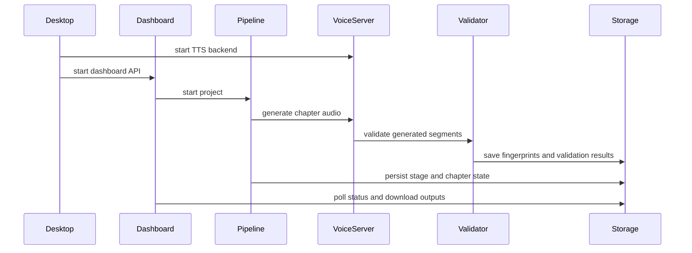

# Complete CodeRabbit Audit for PR #5 (Total Review Comments: 41, Issue Comments: 1)

## Issue Comments / Overview

### Overview Comment #1 by coderabbitai[bot]
```markdown
<!-- This is an auto-generated comment: summarize by coderabbit.ai -->
<!-- review_stack_entry_start -->

[](https://app.coderabbit.ai/change-stack/NicusorFlorinBaluta/crazy-audiobook-creator/pull/5?utm_source=github_walkthrough&utm_medium=github&utm_campaign=change_stack)

<!-- review_stack_entry_end -->
<!-- This is an auto-generated comment: review paused by coderabbit.ai -->

> [!NOTE]
> ## Reviews paused
> 
> It looks like this branch is under active development. To avoid overwhelming you with review comments due to an influx of new commits, CodeRabbit has automatically paused this review. You can configure this behavior by changing the `reviews.auto_review.auto_pause_after_reviewed_commits` setting.
> 
> Use the following commands to manage reviews:
> - `@coderabbitai resume` to resume automatic reviews.
> - `@coderabbitai review` to trigger a single review.
> 
> Use the checkboxes below for quick actions:
> - [ ] <!-- {"checkboxId": "7f6cc2e2-2e4e-497a-8c31-c9e4573e93d1"} --> ▶️ Resume reviews
> - [ ] <!-- {"checkboxId": "e9bb8d72-00e8-4f67-9cb2-caf3b22574fe"} --> ✅ Review completed - (🔄 Check again to review again)

<!-- end of auto-generated comment: review paused by coderabbit.ai -->
<!-- walkthrough_start -->

<details>
<summary>📝 Walkthrough</summary>

## Walkthrough

The change adds persistent voice caching, revised validation and mastering, improved pipeline state handling, dashboard polling and downloads, local voice-server management, an Electron desktop shell, updated sample content, and standalone repair and verification scripts.

### Changes

**Audio pipeline and application runtime**

|Layer / File(s)|Summary|
|---|---|
|**Caching, validation, and audio processing** <br> `voice/tts_server/*`, `voice/validator/*`, `voice/mastering/*`, `shared/constants.py`, `voice/config.yaml`, `implementation_plan_db_improvements.md`|Adds SQLite-backed caches, per-line regeneration checks, revised WER normalization and thresholds, pacing analysis, chapter announcements, vectorized noise gating, and registry caching.|
|**Pipeline orchestration and dashboard flow** <br> `brain/orchestrator/*`, `brain/dashboard/*`, `shared/single_instance.py`, `brain/config.yaml`|Adds persisted logs, single-instance locking, metadata fetching, output fallbacks, chapter downloads, status polling, resume logic, chapter reconciliation, and merged TTS lines.|
|**Voice runtime and desktop launcher management** <br> `voice/tts_server/*`, `parler_server.py`, `desktop/*`, `start_app.pyw`, `create_shortcut.ps1`, `scripts/setup-voice-server.ps1`|Updates voice-server startup, generation patches, CUDA cleanup, request logging, local watchdog restarts, Electron lifecycle handling, launcher behavior, and setup dependencies.|
|**Script attribution and repair tooling** <br> `brain/director/*`, `scratch/*`|Tightens narrator and dialogue attribution and adds scripts for script repair, state resets, diagnostics, API execution, audio mastering, M4B export, and metadata inspection.|
|**Repository content and support files** <br> `sample_book.epub`, `README.md`, `.gitignore`, `desktop/package.json`, `desktop/preload.js`, `start_desktop.cmd`|Replaces EPUB archive content, documents updated features, adds desktop metadata and preload exposure, and ignores Node dependency directories.|

**Estimated code review effort:** 5 (Critical) | ~120 minutes

### Sequence Diagram(s)



**Possibly related PRs**

- [NicusorFlorinBaluta/crazy-audiobook-creator#4](https://github.com/NicusorFlorinBaluta/crazy-audiobook-creator/pull/4): Modifies related dashboard stop/pause control flow and audiobook output download handling.

</details>

<!-- walkthrough_end -->
<!-- pre_merge_checks_walkthrough_start -->

<details>
<summary>🚥 Pre-merge checks | ✅ 3 | ❌ 2</summary>

### ❌ Failed checks (1 warning, 1 inconclusive)

|     Check name     | Status         | Explanation                                                                            | Resolution                                                                                                             |
| :----------------: | :------------- | :------------------------------------------------------------------------------------- | :--------------------------------------------------------------------------------------------------------------------- |
| Docstring Coverage | ⚠️ Warning     | Docstring coverage is 63.29% which is insufficient. The required threshold is 80.00%.  | Write docstrings for the functions missing them to satisfy the coverage threshold.                                     |
|     Title check    | ❓ Inconclusive | The title is too generic and does not describe the actual changes in the pull request. | Use a concise title that names the main change, such as adding the desktop wrapper and pipeline/voice caching updates. |

<details>
<summary>✅ Passed checks (3 passed)</summary>

|         Check name         | Status   | Explanation                                                              |
| :------------------------: | :------- | :----------------------------------------------------------------------- |
|      Description Check     | ✅ Passed | Check skipped - CodeRabbit’s high-level summary is enabled.              |
|     Linked Issues check    | ✅ Passed | Check skipped because no linked issues were found for this pull request. |
| Out of Scope Changes check | ✅ Passed | Check skipped because no linked issues were found for this pull request. |

</details>

</details>

<!-- pre_merge_checks_walkthrough_end -->
<!-- finishing_touch_checkbox_start -->

<details>
<summary>✨ Finishing Touches</summary>

<details>
<summary>🧪 Generate unit tests (beta)</summary>

- [ ] <!-- {"checkboxId": "f47ac10b-58cc-4372-a567-0e02b2c3d479", "radioGroupId": "utg-output-choice-group-unknown_comment_id"} -->   Create PR with unit tests
- [ ] <!-- {"checkboxId": "6ba7b810-9dad-11d1-80b4-00c04fd430c8", "radioGroupId": "utg-output-choice-group-unknown_comment_id"} -->   Commit unit tests in branch `dev`

</details>

</details>

<!-- finishing_touch_checkbox_end -->
<!-- tips_start -->

---


<sub>Comment `@coderabbitai help` to get the list of available commands.</sub>

<!-- tips_end -->
```

## Detailed Review Comments

### [1/41] `brain/dashboard/api/main.py:257` (ID: 3635745767, Commit: `ad2dc49`)
```markdown
_🩺 Stability & Availability_ | _🟡 Minor_ | _⚡ Quick win_

**Store a reference to the background metadata-fetch task.**

`asyncio.create_task(...)` result isn't retained; the task can be garbage-collected before it completes since the event loop only holds a weak reference. Store it in a module-level set (and discard on completion) so the auto-fetch reliably runs to completion.


<details>
<summary>♻️ Proposed fix</summary>

```diff
+_background_tasks: set = set()
+
 ...
-        asyncio.create_task(asyncio.to_thread(_auto_fetch_metadata_sync, status.project_id))
+        task = asyncio.create_task(asyncio.to_thread(_auto_fetch_metadata_sync, status.project_id))
+        _background_tasks.add(task)
+        task.add_done_callback(_background_tasks.discard)
```
</details>

<!-- suggestion_start -->

<details>
<summary>📝 Committable suggestion</summary>

> ‼️ **IMPORTANT**
> Carefully review the code before committing. Ensure that it accurately replaces the highlighted code, contains no missing lines, and has no issues with indentation. Thoroughly test & benchmark the code to ensure it meets the requirements.

```suggestion
_background_tasks: set = set()

        logger.info("[DashboardAPI] Uploaded EPUB '%s' (%d bytes) for project creation", file.filename, len(content))

        status = pipeline.create_project(str(temp_path))
        logger.info("[DashboardAPI] Created project '%s' (%d chapters detected)", status.project_id, status.total_chapters)

        # Automatically fetch metadata and artwork in background
        task = asyncio.create_task(asyncio.to_thread(_auto_fetch_metadata_sync, status.project_id))
        _background_tasks.add(task)
        task.add_done_callback(_background_tasks.discard)
```

</details>

<!-- suggestion_end -->

<details>
<summary>🧰 Tools</summary>

<details>
<summary>🪛 Ruff (0.15.21)</summary>

[warning] 257-257: Store a reference to the return value of `asyncio.create_task`

(RUF006)

</details>

</details>

<details>
<summary>🤖 Prompt for AI Agents</summary>

```
Verify each finding against current code. Fix only still-valid issues, skip the
rest with a brief reason, keep changes minimal, and validate.

In `@brain/dashboard/api/main.py` around lines 251 - 257, Retain the task created
in the project-creation flow around _auto_fetch_metadata_sync by adding it to a
module-level set of background tasks, and register a completion callback that
discards it from that set. Keep the existing asynchronous metadata-fetch
behavior while ensuring the task reference is held until completion.
```

</details>

<!-- fingerprinting:phantom:medusa:beignet -->

<!-- cr-indicator-types:potential_issue -->

<!-- cr-comment:v1:0236d2ed97743642dcf43d9e -->

_Source: Linters/SAST tools_

<!-- This is an auto-generated comment by CodeRabbit -->
```

---

### [2/41] `brain/orchestrator/pipeline.py:628` (ID: 3635745782, Commit: `ad2dc49`)
```markdown
_🗄️ Data Integrity & Integration_ | _🔴 Critical_ | _🏗️ Heavy lift_

<details>
<summary>🧩 Analysis chain</summary>

🏁 Script executed:

```shell
#!/bin/bash
rg -n "def assemble|missing|FileNotFoundError|segments_dir" voice/mastering/assembler.py
```

Repository: NicusorFlorinBaluta/crazy-audiobook-creator

Length of output: 210

---

🏁 Script executed:

```shell
#!/bin/bash
set -euo pipefail

echo '== pipeline outline =='
ast-grep outline brain/orchestrator/pipeline.py --view expanded || true

echo '== assembler outline =='
ast-grep outline voice/mastering/assembler.py --view expanded || true

echo '== pipeline slice =='
sed -n '560,720p' brain/orchestrator/pipeline.py

echo '== assembler slice =='
sed -n '1,220p' voice/mastering/assembler.py
```

Repository: NicusorFlorinBaluta/crazy-audiobook-creator

Length of output: 14981

---

🏁 Script executed:

```shell
#!/bin/bash
set -euo pipefail

echo '== pipeline references =='
rg -n "chapter_script\.lines|merged_lines|line_id|segments/" brain/orchestrator/pipeline.py

echo '== assembler references =='
rg -n "line_id|segments|missing|FileNotFoundError|open\(" voice/mastering/assembler.py

echo '== pipeline around _run_mastering =='
python3 - <<'PY'
from pathlib import Path
p = Path('brain/orchestrator/pipeline.py')
text = p.read_text()
for needle in ['def _run_mastering', 'chapter_script.lines', 'merged_lines', 'segments/']:
    idx = text.find(needle)
    print(f'--- {needle} @ {idx} ---')
    if idx != -1:
        start = max(0, idx - 400)
        end = min(len(text), idx + 900)
        print(text[start:end])
PY
```

Repository: NicusorFlorinBaluta/crazy-audiobook-creator

Length of output: 6975

---


</details>

**Keep mastered segment files aligned with original `line_id`s.** `AudioAssembler.assemble_chapter()` logs a warning and skips missing files, so any merged-away line IDs will be omitted from the final chapter. Either write the merged audio under every original `line_id`, or make mastering consume the same merged groups it generated.

<details>
<summary>🤖 Prompt for AI Agents</summary>

```
Verify each finding against current code. Fix only still-valid issues, skip the
rest with a brief reason, keep changes minimal, and validate.

In `@brain/orchestrator/pipeline.py` around lines 606 - 628, Update the
line-merging flow before GenerateChapterRequest and
AudioAssembler.assemble_chapter() so merged segments remain aligned with the
original line_id values: either preserve/write the generated audio for every
original line_id in each merged group, or pass the same merged groups into
mastering so it consumes the grouped IDs consistently. Ensure no merged-away
original line_id is omitted when assembling the final chapter.
```

</details>

<!-- fingerprinting:phantom:medusa:beignet -->

<!-- cr-indicator-types:potential_issue -->

<!-- cr-comment:v1:2c6801884f7a3267af2a1bfe -->

<!-- This is an auto-generated comment by CodeRabbit -->

✅ Addressed in commits a4fddb4 to 1fa56c3
```

---

### [3/41] `brain/orchestrator/voice_client.py:55` (ID: 3635745784, Commit: `1fa56c3`)
```markdown
_🩺 Stability & Availability_ | _🟠 Major_ | _⚡ Quick win_

**Use a short timeout for health checks.**

`wait_for_server(max_wait_seconds=120)` calls `health_check()` with the new 3600-second default. If the port accepts a connection but never responds, startup blocks for up to an hour instead of honoring its 120-second budget. Pass a small explicit timeout for `/health`.

<details>
<summary>🤖 Prompt for AI Agents</summary>

```
Verify each finding against current code. Fix only still-valid issues, skip the
rest with a brief reason, keep changes minimal, and validate.

In `@brain/orchestrator/voice_client.py` around lines 44 - 53, Update
wait_for_server and its health_check invocation to use a small explicit timeout
for the /health request instead of the VoiceClient default timeout, ensuring an
unresponsive server cannot block startup beyond max_wait_seconds. Keep the
existing retry and overall wait-budget behavior unchanged.
```

</details>

<!-- fingerprinting:phantom:poseidon:terra -->

<!-- cr-indicator-types:potential_issue -->

<!-- cr-comment:v1:c7fa3f96eba9dba7df17f536 -->

<!-- This is an auto-generated comment by CodeRabbit -->
```

---

### [4/41] `brain/orchestrator/watchdog.py:159` (ID: 3635745786, Commit: `ad2dc49`)
```markdown
_🩺 Stability & Availability_ | _🔴 Critical_ | _⚡ Quick win_

<details>
<summary>🧩 Analysis chain</summary>

🏁 Script executed:

```shell
#!/bin/bash
rg -n "^import|^from" brain/orchestrator/watchdog.py
rg -n "Path" brain/orchestrator/watchdog.py
```

Repository: NicusorFlorinBaluta/crazy-audiobook-creator

Length of output: 497

---

🏁 Script executed:

```shell
#!/bin/bash
sed -n '1,40p' brain/orchestrator/watchdog.py
printf '\n---\n'
sed -n '136,165p' brain/orchestrator/watchdog.py
```

Repository: NicusorFlorinBaluta/crazy-audiobook-creator

Length of output: 2460

---


</details>

**Import `Path` here before the restart path runs.** `Path` is used in this method but never imported in `brain/orchestrator/watchdog.py`, so the watchdog will hit a `NameError` the first time it tries to relaunch the voice server. Add `from pathlib import Path` with the other imports.

<details>
<summary>🧰 Tools</summary>

<details>
<summary>🪛 ast-grep (0.44.1)</summary>

[error] 154-158: Command coming from incoming request
Context: subprocess.Popen(
            [str(venv_py), "-m", "voice.tts_server.main"],
            cwd=str(Path.cwd()),
            env=env,
        )
Note: [CWE-78] Improper Neutralization of Special Elements used in an OS Command ('OS Command Injection').

(subprocess-from-request)

</details>
<details>
<summary>🪛 Ruff (0.15.21)</summary>

[error] 146-146: Undefined name `Path`

(F821)

---

[error] 148-148: Undefined name `Path`

(F821)

---

[error] 153-153: Undefined name `Path`

(F821)

---

[error] 155-155: `subprocess` call: check for execution of untrusted input

(S603)

---

[error] 157-157: Undefined name `Path`

(F821)

</details>

</details>

<details>
<summary>🤖 Prompt for AI Agents</summary>

```
Verify each finding against current code. Fix only still-valid issues, skip the
rest with a brief reason, keep changes minimal, and validate.

In `@brain/orchestrator/watchdog.py` around lines 144 - 159, Add the missing
pathlib Path import alongside the existing imports in the watchdog module so the
restart logic using Path in the voice server relaunch method executes without a
NameError.
```

</details>

<!-- fingerprinting:phantom:medusa:beignet -->

<!-- cr-indicator-types:potential_issue -->

<!-- cr-comment:v1:b24bd6b0b1006dd37c35661a -->

_Source: Linters/SAST tools_

<!-- This is an auto-generated comment by CodeRabbit -->
```

---

### [5/41] `create_shortcut.ps1:10` (ID: 3635745791, Commit: `1fa56c3`)
```markdown
_🎯 Functional Correctness_ | _🟡 Minor_ | _⚡ Quick win_

**Resolve the fallback interpreter to an absolute path.**

`pythonw.exe` is not guaranteed to be discoverable from Explorer’s environment, so this shortcut can fail when the fixed venv is absent. Resolve it with `Get-Command` and use its source path, or stop with a clear setup error.

<details>
<summary>🤖 Prompt for AI Agents</summary>

```
Verify each finding against current code. Fix only still-valid issues, skip the
rest with a brief reason, keep changes minimal, and validate.

In `@create_shortcut.ps1` around lines 9 - 10, Update the fallback logic following
the PythonW path check to resolve pythonw.exe via Get-Command and assign its
absolute source path to PythonW; if no command is found, stop with a clear setup
error instead of retaining a bare executable name.
```

</details>

<!-- fingerprinting:phantom:poseidon:terra -->

<!-- cr-indicator-types:potential_issue -->

<!-- cr-comment:v1:1f213b92a4e4b5d9ac612c62 -->

<!-- This is an auto-generated comment by CodeRabbit -->
```

---

### [6/41] `implementation_plan_db_improvements.md:241` (ID: 3635745794, Commit: `1fa56c3`)
```markdown
_🎯 Functional Correctness_ | _🟡 Minor_ | _⚡ Quick win_

**Make the cache smoke test exercise the cache.**

Line 235 passes a nonexistent reference path, so `save_embedding()` returns without storing anything; `b"dummy"` is not a tensor either. Use a real temporary WAV and tensor, then assert that `get_embedding(...)` returns a value.

<details>
<summary>🤖 Prompt for AI Agents</summary>

```
Verify each finding against current code. Fix only still-valid issues, skip the
rest with a brief reason, keep changes minimal, and validate.

In `@implementation_plan_db_improvements.md` at line 235, Update the cache smoke
test command in implementation_plan_db_improvements.md to create and use a real
temporary WAV file and valid tensor data, ensuring save_embedding() stores the
entry instead of returning early. Add an assertion that get_embedding('test',
'narrator') returns a value after saving.
```

</details>

<!-- fingerprinting:phantom:poseidon:terra -->

<!-- cr-indicator-types:potential_issue -->

<!-- cr-comment:v1:bbdaacd1945b438f4ebbacbb -->

<!-- This is an auto-generated comment by CodeRabbit -->
```

---

### [7/41] `parler_server.py:130` (ID: 3635745797, Commit: `1fa56c3`)
```markdown
_🩺 Stability & Availability_ | _🟠 Major_ | _⚡ Quick win_

<details>
<summary>🧩 Analysis chain</summary>

🌐 Web query:

`parler-tts-large-v1 VRAM float32 memory requirement`

💡 Result:

The Parler-TTS Large v1 model, which contains approximately 2.2 billion to 2.3 billion parameters [1][2][3], has a significant VRAM requirement when loaded in full float32 precision. Based on technical benchmarks and resource estimations for this model, running Parler-TTS Large v1 in FP16 (half-precision) requires approximately 68GB of VRAM [4][5]. Since float32 precision typically doubles the memory footprint compared to float16, the theoretical VRAM requirement for the model weights alone in float32 is approximately 136GB. In practice, users generally avoid running this model in float32 because it consumes excessive VRAM without offering tangible improvements in audio quality for inference [6][4]. Most practitioners utilize float16 or bfloat16 for standard usage, or GGUF-based quantization (such as Q4 or Q8) if they are working with more limited hardware [4][5]. Key considerations: - Default Precision: While the model configuration may default to float32 [7], it is highly recommended to use torch_dtype=torch.float16 or torch_dtype=torch.bfloat16 during initialization to reduce VRAM requirements by 50% [6][8]. - Quantization: If you do not have access to massive VRAM capacities (e.g., 68GB+ for FP16), consider using quantized versions, which can reduce requirements significantly (e.g., ~17GB for Q4_K_M or ~34GB for Q8) [4][5].

Citations:

- 1: https://huggingface.co/parler-tts/parler-tts-large-v1
- 2: https://github.com/huggingface/parler-tts/
- 3: https://huggingface.co/parler-tts/parler-tts-large-v1/blob/main/README.md
- 4: https://localai.computer/models/parler-tts-parler-tts-large-v1
- 5: https://localai.computer/models/parler-tts-parler-tts-large-v1/requirements/q4
- 6: https://github.com/huggingface/parler-tts/issues/19
- 7: https://huggingface.co/parler-tts/parler-tts-large-v1/commit/0cd6f2f58dd2f0112459691116ed9c4898b9c66a
- 8: https://gist.github.com/eustlb/1201fbd66dfe552a9fe1fd21d51cb929

---

🏁 Script executed:

```shell
#!/bin/bash
set -euo pipefail

# Locate the file and inspect the relevant region with line numbers.
git ls-files | rg '^parler_server\.py$|/parler_server\.py$|^.*parler_server\.py$' || true
wc -l parler_server.py 2>/dev/null || true
cat -n parler_server.py | sed -n '1,220p'
```

Repository: NicusorFlorinBaluta/crazy-audiobook-creator

Length of output: 11135

---

🏁 Script executed:

```shell
#!/bin/bash
set -euo pipefail

# Find the relevant symbols and nearby logic.
rg -n "float32|float16|bfloat16|device|cuda|ParlerTTSForConditionalGeneration|from_pretrained" parler_server.py

echo
echo "---- relevant section ----"
sed -n '100,160p' parler_server.py | cat -n
```

Repository: NicusorFlorinBaluta/crazy-audiobook-creator

Length of output: 7318

---


</details>

**Load a lower-precision dtype on CUDA.** `torch.float32` is used unconditionally here, so the model is moved to GPU in full precision when available. On the documented 8GB RTX 2080 Super, that is likely to OOM; gate FP32 to CPU and keep float16/bfloat16 on CUDA.

<details>
<summary>🤖 Prompt for AI Agents</summary>

```
Verify each finding against current code. Fix only still-valid issues, skip the
rest with a brief reason, keep changes minimal, and validate.

In `@parler_server.py` around lines 126 - 128, Update the model-loading setup
around model_name, dtype, and ParlerTTSForConditionalGeneration.from_pretrained
so dtype is torch.float32 only on CPU and uses an appropriate lower-precision
dtype, such as float16 or bfloat16, on CUDA. Preserve the existing device
placement and model-loading flow.
```

</details>

<!-- fingerprinting:phantom:medusa:capybara -->

<!-- cr-indicator-types:potential_issue -->

<!-- cr-comment:v1:f96fb55aa84ec3a343bf71af -->

<!-- This is an auto-generated comment by CodeRabbit -->
```

---

### [8/41] `parler_server.py:177` (ID: 3635745808, Commit: `ad2dc49`)
```markdown
_🎯 Functional Correctness_ | _🟠 Major_ | _⚡ Quick win_

<details>
<summary>🧩 Analysis chain</summary>

🌐 Web query:

`parler-tts generate input_ids prompt_input_ids description vs prompt`

💡 Result:

In the Parler-TTS framework, the generate function distinguishes between the descriptive conditioning of the voice and the actual text to be spoken [1][2]. The parameters input_ids and prompt_input_ids serve distinct roles: input_ids: These represent the tokenized description of the desired speech characteristics (e.g., gender, pitch, speaking rate, acoustic quality, and background noise) [2][3][4]. These IDs are processed to guide the model's style and prosody [4]. prompt_input_ids: These represent the tokenized text that the model should convert into speech [2][5]. This is the actual content or transcript you want the model to generate [2]. In practice, you tokenize the description text to create input_ids and the prompt text to create prompt_input_ids, both of which are then passed to the model.generate method [1][5][6]. Depending on the model version, you may use a single tokenizer for both inputs or separate tokenizers for the description and the prompt [5][6]. In newer multilingual or updated versions, it is common to use a specific tokenizer for the description (often accessed via the model config) and a standard tokenizer for the prompt text [5][6].

Citations:

- 1: https://github.com/huggingface/parler-tts/blob/main/INFERENCE.md
- 2: https://github.com/huggingface/parler-tts/blob/main/README.md
- 3: https://huggingface.co/parler-tts/parler-tts-large-v1
- 4: https://huggingface.co/parler-tts/parler-tts-mini-v1
- 5: https://huggingface.co/parler-tts/parler-tts-mini-multilingual
- 6: https://huggingface.co/parler-tts/parler-tts-mini-v1.1

---

🏁 Script executed:

```shell
#!/bin/bash
set -euo pipefail

# Inspect the relevant file and surrounding context
if [ -f parler_server.py ]; then
  wc -l parler_server.py
  sed -n '140,210p' parler_server.py
fi

# Find any other Parler-TTS generate calls or tokenizer usage in the repo
rg -n "prompt_input_ids|input_ids=.*prompt|generate\(" -S .
```

Repository: NicusorFlorinBaluta/crazy-audiobook-creator

Length of output: 4141

---

🏁 Script executed:

```shell
#!/bin/bash
set -euo pipefail

# Inspect the request schema and the endpoint around the bug
sed -n '1,120p' parler_server.py
printf '\n---\n'
sed -n '150,190p' parler_server.py

printf '\n=== voice-design docs/usages ===\n'
rg -n "voices/design|VoiceDesignRequest|request\.prompt|request\.text|voice_description|test sentence" parler_server.py docs README* -S
```

Repository: NicusorFlorinBaluta/crazy-audiobook-creator

Length of output: 10432

---


</details>

**`prompt_input_ids` should use `request.text`**
`input_ids` should stay on the voice description, but `prompt_input_ids` is the text to synthesize; right now both are tokenized from `request.prompt`, so `request.text` is ignored and the model will generate the description instead of the requested speech.

<details>
<summary>🤖 Prompt for AI Agents</summary>

```
Verify each finding against current code. Fix only still-valid issues, skip the
rest with a brief reason, keep changes minimal, and validate.

In `@parler_server.py` around lines 171 - 177, Update the generation setup around
model.generate so input_ids continues using tokenized request.prompt, while
prompt_input_ids is tokenized from request.text and uses the corresponding text
attention mask. Ensure request.text drives the synthesized speech instead of the
voice description.
```

</details>

<!-- fingerprinting:phantom:medusa:capybara -->

<!-- cr-indicator-types:potential_issue -->

<!-- cr-comment:v1:bdc5161a1c7aaa5da060c595 -->

<!-- This is an auto-generated comment by CodeRabbit -->

✅ Addressed in commits a4fddb4 to 1fa56c3
```

---

### [9/41] `parler_server.py:206` (ID: 3635745817, Commit: `1fa56c3`)
```markdown
_🔒 Security & Privacy_ | _🟡 Minor_ | _⚡ Quick win_

**Avoid returning the full traceback in the HTTP response detail.**

Echoing `traceback.format_exc()` into the 500 `detail` leaks internal paths/stack info to clients. Log the traceback (as done) but return a generic message; also chain with `raise ... from e` (B904).


<details>
<summary>🛡️ Proposed change</summary>

```diff
     except Exception as e:
         import traceback
         tb = traceback.format_exc()
         logger.error(f"Error designing voice:\n{tb}")
-        raise HTTPException(status_code=500, detail=f"{e}\n{tb}")
+        raise HTTPException(status_code=500, detail="Voice design failed") from e
```
</details>

<!-- suggestion_start -->

<details>
<summary>📝 Committable suggestion</summary>

> ‼️ **IMPORTANT**
> Carefully review the code before committing. Ensure that it accurately replaces the highlighted code, contains no missing lines, and has no issues with indentation. Thoroughly test & benchmark the code to ensure it meets the requirements.

```suggestion
        import traceback
        tb = traceback.format_exc()
        logger.error(f"Error designing voice:\n{tb}")
        raise HTTPException(status_code=500, detail="Voice design failed") from e
```

</details>

<!-- suggestion_end -->

<details>
<summary>🧰 Tools</summary>

<details>
<summary>🪛 Ruff (0.15.21)</summary>

[warning] 191-191: Within an `except` clause, raise exceptions with `raise ... from err` or `raise ... from None` to distinguish them from errors in exception handling

(B904)

</details>

</details>

<details>
<summary>🤖 Prompt for AI Agents</summary>

```
Verify each finding against current code. Fix only still-valid issues, skip the
rest with a brief reason, keep changes minimal, and validate.

In `@parler_server.py` around lines 188 - 191, Update the exception handling
around the voice-design error in the visible handler: keep logging the full
traceback via logger.error, but replace the HTTPException detail with a generic
client-safe message and raise it using explicit exception chaining from e.
```

</details>

<!-- fingerprinting:phantom:medusa:capybara -->

<!-- cr-indicator-types:potential_issue -->

<!-- cr-comment:v1:c71e80a65b8ce31a30297fe0 -->

_Source: Linters/SAST tools_

<!-- This is an auto-generated comment by CodeRabbit -->
```

---

### [10/41] `scratch/fix_and_export_ch13.py:80` (ID: 3635745824, Commit: `1fa56c3`)
```markdown
_🗄️ Data Integrity & Integration_ | _🟠 Major_ | _⚡ Quick win_

**Validate regenerated audio before mastering.**

`generate_speech()` is not followed by transcription/WER validation, so a newly defective segment is accepted and reported as clean before it is assembled. Re-run the same WER gate after generation and retry or fail the script when it remains above the threshold. `voice/validator/whisper_validator.py:100-170` provides the required contract.

<details>
<summary>🤖 Prompt for AI Agents</summary>

```
Verify each finding against current code. Fix only still-valid issues, skip the
rest with a brief reason, keep changes minimal, and validate.

In `@scratch/fix_and_export_ch13.py` around lines 69 - 80, Update the regeneration
flow around generate_speech() to run the existing Whisper transcription/WER
validation contract from whisper_validator.py before incrementing fixed_count or
reporting success. Apply the same WER threshold used for defective-line
detection, and retry regeneration or fail the script when validation remains
above that threshold; only accept and count segments that pass.
```

</details>

<!-- fingerprinting:phantom:poseidon:terra -->

<!-- cr-indicator-types:potential_issue -->

<!-- cr-comment:v1:8b4e78fe3381b60f29c5ee16 -->

<!-- This is an auto-generated comment by CodeRabbit -->
```

---

### [11/41] `scratch/fix_ch1_master_and_export.py:125` (ID: 3635745829, Commit: `1fa56c3`)
```markdown
_🗄️ Data Integrity & Integration_ | _🟠 Major_ | _⚡ Quick win_

**Do not export chapters with silently omitted lines.**

This filter drops every missing segment. Only Chapter 1 is regenerated above, so Chapters 2 and 3 can be mastered and exported as truncated audio; a Chapter 1 validation failure has the same outcome. Generate missing segments for every requested chapter, or fail before assembly when any expected `line_id` is absent.

<details>
<summary>🧰 Tools</summary>

<details>
<summary>🪛 Ruff (0.15.21)</summary>

[error] 123-123: Ambiguous variable name: `l`

(E741)

</details>

</details>

<details>
<summary>🤖 Prompt for AI Agents</summary>

```
Verify each finding against current code. Fix only still-valid issues, skip the
rest with a brief reason, keep changes minimal, and validate.

In `@scratch/fix_ch1_master_and_export.py` around lines 116 - 125, Update the
segment assembly flow that builds the MasterSegmentInfo list so missing expected
line_id files are never silently filtered out. Before mastering or exporting
each requested chapter, ensure every expected segment is generated for that
chapter, or fail immediately when any segment is absent, including when Chapter
1 validation fails; do not allow Chapters 2 or 3 to proceed with truncated
audio.
```

</details>

<!-- fingerprinting:phantom:poseidon:terra -->

<!-- cr-indicator-types:potential_issue -->

<!-- cr-comment:v1:3142931a45ed8c15ea2031e0 -->

<!-- This is an auto-generated comment by CodeRabbit -->
```

---

### [12/41] `scratch/fix_ch1_master_and_export.py:173` (ID: 3635745837, Commit: `1fa56c3`)
```markdown
_🗄️ Data Integrity & Integration_ | _🟠 Major_ | _⚡ Quick win_

**Derive pipeline completion state from verified artifacts.** Both scripts mark all three chapters generated and mastered regardless of missing, failed, or truncated audio; the dashboard returns this persisted state directly, so users can see a false completed state and resume logic may skip required work.
- `scratch/fix_ch1_master_and_export.py#L168-L173`: populate chapter lists only after every expected segment is present and the mastered/exported artifact succeeds.
- `scratch/update_db.py#L10-L17`: remove the unconditional completion mutation or derive it from the same verified chapter results.

<details>
<summary>🧰 Tools</summary>

<details>
<summary>🪛 ast-grep (0.44.1)</summary>

[info] 172-172: use jsonify instead of json.dumps for JSON output
Context: json.dumps(state)
Note: [CWE-116] Improper Encoding or Escaping of Output.

(use-jsonify)

</details>

</details>

<details>
<summary>📍 Affects 2 files</summary>

- `scratch/fix_ch1_master_and_export.py#L168-L173` (this comment)
- `scratch/update_db.py#L10-L17`

</details>

<details>
<summary>🤖 Prompt for AI Agents</summary>

```
Verify each finding against current code. Fix only still-valid issues, skip the
rest with a brief reason, keep changes minimal, and validate.

In `@scratch/fix_ch1_master_and_export.py` around lines 168 - 173, Derive
completion state from verified chapter artifacts instead of unconditionally
marking all chapters complete: in scratch/fix_ch1_master_and_export.py lines
168-173, populate mastered_chapters and generated_chapters only after every
expected segment exists and mastering/export succeeds; in scratch/update_db.py
lines 10-17, remove the unconditional completion mutation or derive it from
those same verified results.
```

</details>

<!-- consolidated_sites_start -->
<!--
<consolidated_sites>
<site>
<role>anchor</role>
<file>scratch/fix_ch1_master_and_export.py</file>
<line_range>168-173</line_range>
</site>
<site>
<role>sibling</role>
<file>scratch/update_db.py</file>
<line_range>10-17</line_range>
</site>
</consolidated_sites>
-->
<!-- consolidated_sites_end -->

<!-- fingerprinting:phantom:poseidon:terra -->

<!-- cr-indicator-types:potential_issue -->

<!-- cr-comment:v1:9dcb8fd87b97a7cc892e386f -->

<!-- This is an auto-generated comment by CodeRabbit -->
```

---

### [13/41] `scratch/repair_ch1_script.py:41` (ID: 3635745842, Commit: `1fa56c3`)
```markdown
_🎯 Functional Correctness_ | _🟠 Major_ | _🏗️ Heavy lift_

**Do not assign all quoted dialogue to `starling`.**

This heuristic overwrites every fully quoted utterance with Starling’s voice, regardless of the speaker registry, and misses dialogue that includes attribution outside the quotes. Reuse the project’s speaker-attribution logic and `CharacterRegistry` rather than regenerating Chapter 1 with this hard-coded mapping.

<details>
<summary>🤖 Prompt for AI Agents</summary>

```
Verify each finding against current code. Fix only still-valid issues, skip the
rest with a brief reason, keep changes minimal, and validate.

In `@scratch/repair_ch1_script.py` around lines 25 - 41, Replace the hard-coded
speaker assignment in the fragments loop with the project’s existing
speaker-attribution logic, using CharacterRegistry to resolve quoted dialogue
and attribution outside quotation marks. Preserve the default narrator behavior
when attribution is absent, and avoid assigning every fully quoted fragment to
starling.
```

</details>

<!-- fingerprinting:phantom:poseidon:terra -->

<!-- cr-indicator-types:potential_issue -->

<!-- cr-comment:v1:779765e16fa6418870571733 -->

<!-- This is an auto-generated comment by CodeRabbit -->
```

---

### [14/41] `scratch/test_e2e_chapter1.py:27` (ID: 3635745849, Commit: `1fa56c3`)
```markdown
_🩺 Stability & Availability_ | _🟠 Major_ | _⚡ Quick win_

**Bound all HTTP calls and the polling loop.**

A stalled local server or request can block this E2E test forever; repeated non-200 status responses also loop forever. Add per-request timeouts and an overall pipeline deadline that fails with the last observed state.  
   


Also applies to: 48-48, 60-60, 68-68, 77-77, 88-93, 123-123

<details>
<summary>🧰 Tools</summary>

<details>
<summary>🪛 Ruff (0.15.21)</summary>

[error] 27-27: Probable use of `requests` call without timeout

(S113)

</details>

</details>

<details>
<summary>🤖 Prompt for AI Agents</summary>

```
Verify each finding against current code. Fix only still-valid issues, skip the
rest with a brief reason, keep changes minimal, and validate.

In `@scratch/test_e2e_chapter1.py` at line 27, Update the E2E workflow in
test_e2e_chapter1.py so every requests.get/post call, including the listed
project, polling, and pipeline requests, uses an explicit per-request timeout.
Bound the polling loop with an overall deadline, and when it expires or repeated
non-200 responses persist, fail the test while reporting the last observed
state.
```

</details>

<!-- fingerprinting:phantom:poseidon:terra -->

<!-- cr-indicator-types:potential_issue -->

<!-- cr-comment:v1:c553cb95fa480f6f7bf82a61 -->

_Source: Linters/SAST tools_

<!-- This is an auto-generated comment by CodeRabbit -->
```

---

### [15/41] `scratch/test_e2e_chapter1.py:117` (ID: 3635745853, Commit: `1fa56c3`)
```markdown
_🎯 Functional Correctness_ | _🟠 Major_ | _⚡ Quick win_

**Match the download endpoint’s output search behavior.**

The dashboard can serve an M4B from `workspace/{project_id}/output` (and other workspace locations), but this assertion only searches `brain/projects/{project_id}`. A valid completed export can therefore fail this E2E test before the download endpoint is checked. Search the same locations or validate the download response directly.

<details>
<summary>🤖 Prompt for AI Agents</summary>

```
Verify each finding against current code. Fix only still-valid issues, skip the
rest with a brief reason, keep changes minimal, and validate.

In `@scratch/test_e2e_chapter1.py` around lines 112 - 117, Update the M4B
validation in the E2E flow around project_dir and m4b_files to match the
download endpoint’s workspace output search behavior, including
workspace/{project_id}/output and other supported workspace locations, or
validate the download response directly. Keep the failure assertion for
genuinely missing exports.
```

</details>

<!-- fingerprinting:phantom:poseidon:terra -->

<!-- cr-indicator-types:potential_issue -->

<!-- cr-comment:v1:3234e4e2fcdfbe52ef579af5 -->

<!-- This is an auto-generated comment by CodeRabbit -->
```

---

### [16/41] `scratch/verify_m4b.py:10` (ID: 3635745859, Commit: `1fa56c3`)
```markdown
_🩺 Stability & Availability_ | _🟡 Minor_ | _⚡ Quick win_

**Validate the input and `ffprobe` result before parsing.**

A missing M4B, unavailable `ffprobe`, or probe failure currently crashes at `stat()` or `json.loads()`. Check `m4b.is_file()` and run `ffprobe` with `check=True`/error reporting before decoding stdout.

<details>
<summary>🧰 Tools</summary>

<details>
<summary>🪛 ast-grep (0.44.1)</summary>

[error] 8-8: Command coming from incoming request
Context: subprocess.run(['ffprobe', '-v', 'quiet', '-print_format', 'json', '-show_chapters', str(m4b)], capture_output=True, text=True)
Note: [CWE-78] Improper Neutralization of Special Elements used in an OS Command ('OS Command Injection').

(subprocess-from-request)

</details>
<details>
<summary>🪛 Ruff (0.15.21)</summary>

[error] 9-9: `subprocess` call: check for execution of untrusted input

(S603)

---

[error] 9-9: Starting a process with a partial executable path

(S607)

</details>

</details>

<details>
<summary>🤖 Prompt for AI Agents</summary>

```
Verify each finding against current code. Fix only still-valid issues, skip the
rest with a brief reason, keep changes minimal, and validate.

In `@scratch/verify_m4b.py` around lines 5 - 10, Update the verification flow
around m4b and subprocess.run to validate m4b.is_file() before accessing its
size, and run ffprobe with check=True while surfacing execution errors. Only
pass successful stdout to json.loads, preserving the existing chapter data
parsing behavior.
```

</details>

<!-- fingerprinting:phantom:poseidon:terra -->

<!-- cr-indicator-types:potential_issue -->

<!-- cr-comment:v1:ab554a2dab3926fc44433f4d -->

<!-- This is an auto-generated comment by CodeRabbit -->
```

---

### [17/41] `shared/single_instance.py:59` (ID: 3635745863, Commit: `1fa56c3`)
```markdown
_🩺 Stability & Availability_ | _🟠 Major_ | _⚡ Quick win_

**Do not unlink an advisory-lock file during release.**

After the unlock at Line 46/49, another process can acquire the existing lock before Line 57 removes its pathname. A third process can then create and lock a new file, allowing two instances concurrently. Keep the lock file; OS-managed advisory locks are released when the process exits.

<details>
<summary>🧰 Tools</summary>

<details>
<summary>🪛 Ruff (0.15.21)</summary>

[error] 58-59: `try`-`except`-`pass` detected, consider logging the exception

(S110)

---

[warning] 58-58: Do not catch blind exception: `Exception`

(BLE001)

</details>

</details>

<details>
<summary>🤖 Prompt for AI Agents</summary>

```
Verify each finding against current code. Fix only still-valid issues, skip the
rest with a brief reason, keep changes minimal, and validate.

In `@shared/single_instance.py` around lines 55 - 59, Remove the
lock_file.unlink() call from the release cleanup in the single-instance lock
implementation, while retaining the unlock operation. Keep the existing lock
file so other processes always contend on the same pathname; rely on the OS to
release the advisory lock when the process exits.
```

</details>

<!-- fingerprinting:phantom:poseidon:terra -->

<!-- cr-indicator-types:potential_issue -->

<!-- cr-comment:v1:25665a3d26d021d8c9bad667 -->

<!-- This is an auto-generated comment by CodeRabbit -->
```

---

### [18/41] `start_app.pyw:52` (ID: 3635745867, Commit: `1fa56c3`)
```markdown
_🩺 Stability & Availability_ | _🟡 Minor_ | _⚡ Quick win_

**Restore readiness polling before opening the browser.**

A fixed two-second sleep races dashboard startup. On a slower startup, the browser receives a connection failure and will not automatically retry. Poll a lightweight local endpoint with a bounded timeout before opening the URL.

<details>
<summary>🤖 Prompt for AI Agents</summary>

```
Verify each finding against current code. Fix only still-valid issues, skip the
rest with a brief reason, keep changes minimal, and validate.

In `@start_app.pyw` around lines 31 - 35, Replace the fixed time.sleep delay in
the startup flow before webbrowser.open with bounded readiness polling against a
lightweight local endpoint. Continue polling until the endpoint responds or the
timeout expires, then preserve the existing browser-opening behavior without
allowing startup to wait indefinitely.
```

</details>

<!-- fingerprinting:phantom:poseidon:terra -->

<!-- cr-indicator-types:potential_issue -->

<!-- cr-comment:v1:7e79628f725064de7675bc02 -->

<!-- This is an auto-generated comment by CodeRabbit -->
```

---

### [19/41] `voice/tts_server/main.py:279` (ID: 3635745870, Commit: `ad2dc49`)
```markdown
_🎯 Functional Correctness_ | _🟠 Major_ | _⚡ Quick win_

**Do not silently substitute the narrator for a missing character voice.**

A typo or failed voice bootstrap now produces narrator audio while reporting generation success, permanently masking an incorrect character performance. Preserve the 404, or make fallback explicitly opt-in and return the effective speaker.

<details>
<summary>🤖 Prompt for AI Agents</summary>

```
Verify each finding against current code. Fix only still-valid issues, skip the
rest with a brief reason, keep changes minimal, and validate.

In `@voice/tts_server/main.py` around lines 276 - 279, Update the voice resolution
flow around library.get_voice_path so a missing requested character voice does
not silently switch to "narrator"; preserve the existing not-found/404 failure
behavior, or require an explicit opt-in before fallback. If fallback remains
supported, return the effective speaker alongside the generated result.
```

</details>

<!-- fingerprinting:phantom:poseidon:terra -->

<!-- cr-indicator-types:potential_issue -->

<!-- cr-comment:v1:a308556979180ed2738b2529 -->

<!-- This is an auto-generated comment by CodeRabbit -->
```

---

### [20/41] `desktop/main.js:72` (ID: 3635759027, Commit: `ad2dc49`)
```markdown
_🩺 Stability & Availability_ | _🟠 Major_ | _⚡ Quick win_

<details>
<summary>🧩 Analysis chain</summary>

🏁 Script executed:

```shell
#!/bin/bash
set -euo pipefail

# Show the relevant file with line numbers
wc -l desktop/main.js
sed -n '1,220p' desktop/main.js

# Look for any existing child-process error handling in the desktop app
rg -n "once\\('error'|on\\('error'|spawn\\(|pythonProcesses|stop.*process|kill\\(" desktop -S
```

Repository: NicusorFlorinBaluta/crazy-audiobook-creator

Length of output: 5156

---

🏁 Script executed:

```shell
#!/bin/bash
set -euo pipefail

# Inspect Node.js child_process.spawn semantics from installed docs if available in the runtime
node - <<'JS'
const { spawn } = require('child_process');
console.log(typeof spawn);
JS
```

Repository: NicusorFlorinBaluta/crazy-audiobook-creator

Length of output: 190

---


</details>

**Handle `spawn()` errors for the Python services.**  
If `python` is missing or the executable cannot be started, both `spawn()` calls emit an unhandled `error` event and can terminate Electron before startup failure is reported.

<details>
<summary>Proposed fix</summary>

```diff
   const voiceProc = spawn(pythonExe, ['-m', 'voice.tts_server.main'], {
     cwd: rootDir,
     env: env,
     stdio: 'ignore'
   });
+  voiceProc.once('error', (error) => {
+    console.error('[Electron] Voice Server failed to start:', error);
+  });
+
   if (voiceProc.pid) {
     pythonProcesses.push(voiceProc);
     console.log(`[Electron] Launched Voice Server (PID ${voiceProc.pid})`);
   }
@@
   const dashProc = spawn(pythonExe, ['-m', 'uvicorn', 'brain.dashboard.api.main:app', '--host', '127.0.0.1', '--port', '8000'], {
     cwd: rootDir,
     env: env,
     stdio: 'ignore'
   });
+  dashProc.once('error', (error) => {
+    console.error('[Electron] Dashboard API failed to start:', error);
+  });
```
</details>

<!-- suggestion_start -->

<details>
<summary>📝 Committable suggestion</summary>

> ‼️ **IMPORTANT**
> Carefully review the code before committing. Ensure that it accurately replaces the highlighted code, contains no missing lines, and has no issues with indentation. Thoroughly test & benchmark the code to ensure it meets the requirements.

```suggestion
  const voiceProc = spawn(pythonExe, ['-m', 'voice.tts_server.main'], {
    cwd: rootDir,
    env: env,
    stdio: 'ignore'
  });
  voiceProc.once('error', (error) => {
    console.error('[Electron] Voice Server failed to start:', error);
  });

  if (voiceProc.pid) {
    pythonProcesses.push(voiceProc);
    console.log(`[Electron] Launched Voice Server (PID ${voiceProc.pid})`);
  }

  // 2. Start Dashboard API (port 8000)
  const dashProc = spawn(pythonExe, ['-m', 'uvicorn', 'brain.dashboard.api.main:app', '--host', '127.0.0.1', '--port', '8000'], {
    cwd: rootDir,
    env: env,
    stdio: 'ignore'
  });
  dashProc.once('error', (error) => {
    console.error('[Electron] Dashboard API failed to start:', error);
  });
  if (dashProc.pid) {
    pythonProcesses.push(dashProc);
    console.log(`[Electron] Launched Dashboard API (PID ${dashProc.pid})`);
  }
```

</details>

<!-- suggestion_end -->

<details>
<summary>🤖 Prompt for AI Agents</summary>

```
Verify each finding against current code. Fix only still-valid issues, skip the
rest with a brief reason, keep changes minimal, and validate.

In `@desktop/main.js` around lines 53 - 72, Update the Voice Server and Dashboard
API process startup around the two spawn calls to register error handlers for
each ChildProcess before startup can fail. Report a clear service-specific
startup error and preserve the existing process tracking and launch logging for
successfully spawned processes, preventing unhandled spawn error events from
terminating Electron.
```

</details>

<!-- fingerprinting:phantom:poseidon:terra -->

<!-- cr-indicator-types:potential_issue -->

<!-- cr-comment:v1:ecf4d92edd14b32e6f275e67 -->

<!-- This is an auto-generated comment by CodeRabbit -->
```

---

### [21/41] `desktop/main.js:154` (ID: 3635759041, Commit: `1fa56c3`)
```markdown
_🩺 Stability & Availability_ | _🟠 Major_ | _⚡ Quick win_

<details>
<summary>🧩 Analysis chain</summary>

🏁 Script executed:

```shell
#!/bin/bash
set -euo pipefail

printf '\n== desktop/main.js excerpts ==\n'
nl -ba desktop/main.js | sed -n '100,210p'

printf '\n== search stopPythonProcesses ==\n'
rg -n "stopPythonProcesses|before-quit|window-all-closed|activate|quit" desktop/main.js desktop -S
```

Repository: NicusorFlorinBaluta/crazy-audiobook-creator

Length of output: 253

---

🏁 Script executed:

```shell
#!/bin/bash
set -euo pipefail
nl -ba desktop/main.js | sed -n '1,260p'
```

Repository: NicusorFlorinBaluta/crazy-audiobook-creator

Length of output: 221

---

🏁 Script executed:

```shell
#!/bin/bash
set -euo pipefail

printf '\n== desktop/main.js (relevant lines) ==\n'
awk 'NR>=100 && NR<=220 { printf "%4d  %s\n", NR, $0 }' desktop/main.js

printf '\n== lifecycle/search matches ==\n'
rg -n "stopPythonProcesses|before-quit|window-all-closed|activate|quit" desktop/main.js desktop -S
```

Repository: NicusorFlorinBaluta/crazy-audiobook-creator

Length of output: 3036

---


</details>

**Keep backend shutdown in `before-quit` only.**  
On macOS, closing the last window does not exit Electron, so `stopPythonProcesses()` here leaves the app running with no backend when the window is reopened. Gate this cleanup on an actual app quit and leave the window handlers to window lifecycle only.

<details>
<summary>📍 Affects 1 file</summary>

- `desktop/main.js#L129-L135` (this comment)
- `desktop/main.js#L162-L168`

</details>

<details>
<summary>🤖 Prompt for AI Agents</summary>

```
Verify each finding against current code. Fix only still-valid issues, skip the
rest with a brief reason, keep changes minimal, and validate.

In `@desktop/main.js` around lines 129 - 135, Remove the stopPythonProcesses()
call and related quit-state mutation from the mainWindow close handler, keeping
it limited to window lifecycle behavior. Ensure backend shutdown remains
exclusively in the app’s before-quit handler at desktop/main.js lines 162-168.
```

</details>

<!-- consolidated_sites_start -->
<!--
<consolidated_sites>
<site>
<role>anchor</role>
<file>desktop/main.js</file>
<line_range>129-135</line_range>
</site>
<site>
<role>sibling</role>
<file>desktop/main.js</file>
<line_range>162-168</line_range>
</site>
</consolidated_sites>
-->
<!-- consolidated_sites_end -->

<!-- fingerprinting:phantom:poseidon:terra -->

<!-- cr-indicator-types:potential_issue -->

<!-- cr-comment:v1:ebbb304b431d99d13e9c5ef5 -->

<!-- This is an auto-generated comment by CodeRabbit -->
```

---

### [22/41] `brain/dashboard/api/main.py:525` (ID: 3640741737, Commit: `ad2dc49`)
```markdown
_🎯 Functional Correctness_ | _🟠 Major_ | _⚡ Quick win_

**Count actual generated segments, not synthetic merged batches.**

`ValidationLoop` generates and writes one WAV for each `ScriptLine`, while this block merges adjacent lines into a smaller denominator. Chapters with consecutive matching speakers/emotions can show 100% progress after only a fraction of their segments exist.

<details>
<summary>Proposed fix</summary>

```diff
-                    # Count merged line batches matching TTS generation merging
-                    merged_count = 0
-                    prev_speaker = None
-                    prev_emotion = None
-                    prev_words = 0
-
-                    for l in raw_lines:
-                        spk = l.get("speaker")
-                        emo = (l.get("emotion") or "").strip().lower()
-                        words = len((l.get("text") or "").split())
-                        if prev_speaker == spk and prev_emotion == emo and (prev_words + words < 250):
-                            prev_words += words
-                        else:
-                            merged_count += 1
-                            prev_speaker = spk
-                            prev_emotion = emo
-                            prev_words = words
-
-                    total_lines = merged_count or len(raw_lines)
+                    total_lines = len(raw_lines)
```
</details>

<!-- suggestion_start -->

<details>
<summary>📝 Committable suggestion</summary>

> ‼️ **IMPORTANT**
> Carefully review the code before committing. Ensure that it accurately replaces the highlighted code, contains no missing lines, and has no issues with indentation. Thoroughly test & benchmark the code to ensure it meets the requirements.

```suggestion
                    total_lines = len(raw_lines)
```

</details>

<!-- suggestion_end -->

<details>
<summary>🧰 Tools</summary>

<details>
<summary>🪛 Ruff (0.15.21)</summary>

[error] 513-513: Ambiguous variable name: `l`

(E741)

</details>

</details>

<details>
<summary>🤖 Prompt for AI Agents</summary>

```
Verify each finding against current code. Fix only still-valid issues, skip the
rest with a brief reason, keep changes minimal, and validate.

In `@brain/dashboard/api/main.py` around lines 507 - 525, Update the progress
denominator calculation in the block iterating over raw_lines to count actual
generated segments, using the number of ScriptLine entries rather than synthetic
speaker/emotion/word-based merged batches. Remove the merged_count state and
associated merging logic, while preserving the existing fallback behavior for
empty raw_lines if needed by the surrounding progress calculation.
```

</details>

<!-- fingerprinting:phantom:poseidon:terra -->

<!-- cr-indicator-types:potential_issue -->

<!-- cr-comment:v1:74b154e9a293ebb3a9924a02 -->

<!-- This is an auto-generated comment by CodeRabbit -->

✅ Addressed in commits a4fddb4 to 1fa56c3
```

---

### [23/41] `brain/director/script_generator.py:793` (ID: 3640741756, Commit: `1fa56c3`)
```markdown
_🎯 Functional Correctness_ | _🟡 Minor_ | _⚡ Quick win_

**Guard against explicit `null` speaker in model output.**

`str(meta.get("speaker", "narrator"))` only falls back to `"narrator"` when the `"speaker"` key is *missing*; if the LLM emits `"speaker": null`, `meta.get` returns `None` (key is present) and this becomes the literal string `"none"`, which then gets registered as a bogus character via `_detect_new_characters`. Two lines below, `pause_before_ms`/`pause_after_ms` already guard against this exact case with `... or 0`/`... or 500` — the same pattern should be applied here.

<details>
<summary>🐛 Proposed fix</summary>

```diff
-            speaker = str(meta.get("speaker", "narrator")).lower().replace(" ", "_")
+            speaker = str(meta.get("speaker") or "narrator").lower().replace(" ", "_")
```
</details>

<!-- suggestion_start -->

<details>
<summary>📝 Committable suggestion</summary>

> ‼️ **IMPORTANT**
> Carefully review the code before committing. Ensure that it accurately replaces the highlighted code, contains no missing lines, and has no issues with indentation. Thoroughly test & benchmark the code to ensure it meets the requirements.

```suggestion

            text_trimmed = text.strip()
            is_quote = bool(quote_pattern.match(text_trimmed))
            
            # CRITICAL RULE: Non-dialogue text outside quotation marks MUST be narrator!
            speaker = str(meta.get("speaker") or "narrator").lower().replace(" ", "_")
            if not is_quote:
                speaker = "narrator"
                
            lines.append(
                ScriptLine(
                    line_id=f"ch{fallback_number:02d}_{i:03d}",
                    speaker=speaker,
```

</details>

<!-- suggestion_end -->

<details>
<summary>🤖 Prompt for AI Agents</summary>

```
Verify each finding against current code. Fix only still-valid issues, skip the
rest with a brief reason, keep changes minimal, and validate.

In `@brain/director/script_generator.py` around lines 499 - 511, Update speaker
extraction in the script-line construction flow to treat an explicit null
speaker like a missing speaker by applying a narrator fallback before string
normalization. Preserve the existing lowercasing, space replacement, and
non-quote narrator override, and ensure _detect_new_characters never receives
the literal “none” speaker.
```

</details>

<!-- fingerprinting:phantom:medusa:beignet -->

<!-- cr-indicator-types:potential_issue -->

<!-- cr-comment:v1:a8f3b27ef102ca4ed06b1f81 -->

<!-- This is an auto-generated comment by CodeRabbit -->

✅ Addressed in commits a4fddb4 to 1fa56c3
```

---

### [24/41] `scratch/check_progress.py:7` (ID: 3640741771, Commit: `1fa56c3`)
```markdown
_🩺 Stability & Availability_ | _🟡 Minor_ | _⚡ Quick win_

**Local dashboard/voice HTTP requests need bounded waits.**

- `scratch/check_progress.py#L7-L7`: add a timeout to the voice health request.
- `scratch/check_progress.py#L14-L15`: add a timeout to the dashboard status request.
- `scratch/force_full_rebuild.py#L13-L14`: add a timeout to the stop request.
- `scratch/master_all_and_export.py#L29-L31`: add a timeout to the start request.
- `scratch/reset_all_chapters.py#L12-L13`: add a timeout to the stop request.
- `scratch/reset_all_chapters.py#L60-L61`: add a timeout to the start request.

<details>
<summary>📍 Affects 4 files</summary>

- `scratch/check_progress.py#L7-L7` (this comment)
- `scratch/check_progress.py#L14-L15`
- `scratch/force_full_rebuild.py#L13-L14`
- `scratch/master_all_and_export.py#L29-L31`
- `scratch/reset_all_chapters.py#L12-L13`
- `scratch/reset_all_chapters.py#L60-L61`

</details>

<details>
<summary>🤖 Prompt for AI Agents</summary>

```
Verify each finding against current code. Fix only still-valid issues, skip the
rest with a brief reason, keep changes minimal, and validate.

In `@scratch/check_progress.py` at line 7, Bound all local dashboard and voice
HTTP requests with an explicit timeout: update the health and dashboard status
requests in scratch/check_progress.py, the stop request in
scratch/force_full_rebuild.py, the start request in
scratch/master_all_and_export.py, and the stop and start requests in
scratch/reset_all_chapters.py. Use the same finite timeout consistently across
these request calls.
```

</details>

<!-- consolidated_sites_start -->
<!--
<consolidated_sites>
<site>
<role>anchor</role>
<file>scratch/check_progress.py</file>
<line_range>7-7</line_range>
</site>
<site>
<role>sibling</role>
<file>scratch/check_progress.py</file>
<line_range>14-15</line_range>
</site>
<site>
<role>sibling</role>
<file>scratch/force_full_rebuild.py</file>
<line_range>13-14</line_range>
</site>
<site>
<role>sibling</role>
<file>scratch/master_all_and_export.py</file>
<line_range>29-31</line_range>
</site>
<site>
<role>sibling</role>
<file>scratch/reset_all_chapters.py</file>
<line_range>12-13</line_range>
</site>
<site>
<role>sibling</role>
<file>scratch/reset_all_chapters.py</file>
<line_range>60-61</line_range>
</site>
</consolidated_sites>
-->
<!-- consolidated_sites_end -->

<!-- fingerprinting:phantom:poseidon:terra -->

<!-- cr-indicator-types:potential_issue -->

<!-- cr-comment:v1:fc420883f179d55a10354888 -->

<!-- This is an auto-generated comment by CodeRabbit -->
```

---

### [25/41] `scratch/fix_dialogue_quote_speakers.py:63` (ID: 3640741778, Commit: `1fa56c3`)
```markdown
_🎯 Functional Correctness_ | _🔴 Critical_ | _⚡ Quick win_

**Index-out-of-bounds crash / silent wraparound in adjacency check.**

`lines[idx + 1]` and `lines[idx - 1]` are accessed a second time inside the `adjacent_narrative` expression without the bounds guard already applied to `next_text`/`prev_text`. This will raise `IndexError` whenever a quoted line is the last line in a chapter script (`idx + 1 == len(lines)`), and will silently wrap to `lines[-1]` when `idx == 0`, corrupting the adjacency check with unrelated text.

<details>
<summary>🐛 Proposed fix</summary>

```diff
         if is_quote:
-            next_text = lines[idx + 1]["text"].lower() if idx + 1 < len(lines) else ""
-            prev_text = lines[idx - 1]["text"].lower() if idx > 0 else ""
-            adjacent_narrative = (next_text if not quote_pattern.match(lines[idx + 1]["text"].strip()) else "") + " " + (prev_text if not quote_pattern.match(lines[idx - 1]["text"].strip()) else "")
+            has_next = idx + 1 < len(lines)
+            has_prev = idx > 0
+            next_text = lines[idx + 1]["text"].lower() if has_next else ""
+            prev_text = lines[idx - 1]["text"].lower() if has_prev else ""
+            next_is_quote = has_next and quote_pattern.match(lines[idx + 1]["text"].strip())
+            prev_is_quote = has_prev and quote_pattern.match(lines[idx - 1]["text"].strip())
+            adjacent_narrative = (next_text if has_next and not next_is_quote else "") + " " + (prev_text if has_prev and not prev_is_quote else "")
```
</details>

<!-- suggestion_start -->

<details>
<summary>📝 Committable suggestion</summary>

> ‼️ **IMPORTANT**
> Carefully review the code before committing. Ensure that it accurately replaces the highlighted code, contains no missing lines, and has no issues with indentation. Thoroughly test & benchmark the code to ensure it meets the requirements.

```suggestion
    for idx, line in enumerate(lines):
        text_trimmed = line.get("text", "").strip()
        is_quote = bool(quote_pattern.match(text_trimmed))
        spk = line.get("speaker", "narrator").lower()
        
        if is_quote:
            has_next = idx + 1 < len(lines)
            has_prev = idx > 0
            next_text = lines[idx + 1]["text"].lower() if has_next else ""
            prev_text = lines[idx - 1]["text"].lower() if has_prev else ""
            next_is_quote = has_next and quote_pattern.match(lines[idx + 1]["text"].strip())
            prev_is_quote = has_prev and quote_pattern.match(lines[idx - 1]["text"].strip())
            adjacent_narrative = (next_text if has_next and not next_is_quote else "") + " " + (prev_text if has_prev and not prev_is_quote else "")
            
            # Check 1: Explicit character name in adjacent narration (e.g. "Vathi said", "Dusk called")
            found_cid = None
            for name_key, cid in name_to_cid.items():
                if re.search(r'\b' + re.escape(name_key) + r'\b\s*(said|whispered|asked|replied|cried|smiled|called|nodded|thought|spoke)', adjacent_narrative):
                    found_cid = cid
                    break
            
            if found_cid and found_cid != spk:
                line["speaker"] = found_cid
                ch_fixes += 1
                quote_fixes += 1
                print(f"Name Tag Fix [{s_file.name} / {line['line_id']}]: '{spk}' -> '{found_cid}' (tag: '{adjacent_narrative.strip()}')")
                continue
```

</details>

<!-- suggestion_end -->

<details>
<summary>🧰 Tools</summary>

<details>
<summary>🪛 ast-grep (0.44.1)</summary>

[warning] 53-53: Regex pattern passed to re is built from a non-literal (variable, call, concatenation, or f-string) value. If that value is attacker-controlled it can introduce a malicious pattern with catastrophic backtracking (ReDoS). Use a hardcoded literal pattern, or validate/escape untrusted input with re.escape() and bound the regex complexity before compiling.
Context: re.search(r'\b' + re.escape(name_key) + r'\b\s*(said|whispered|asked|replied|cried|smiled|called|nodded|thought|spoke)', adjacent_narrative)
Note: [CWE-1333] Inefficient Regular Expression Complexity.

(redos-non-literal-regex-python)

</details>

</details>

<details>
<summary>🤖 Prompt for AI Agents</summary>

```
Verify each finding against current code. Fix only still-valid issues, skip the
rest with a brief reason, keep changes minimal, and validate.

In `@scratch/fix_dialogue_quote_speakers.py` around lines 41 - 63, Fix the
adjacency check in the quote-processing loop by reusing the bounds-safe
next_text and prev_text values, or otherwise guard both neighbor accesses before
reading their text. Update the adjacent_narrative construction around the
is_quote branch so last-line quotes do not raise IndexError and first-line
quotes do not inspect unrelated trailing text.
```

</details>

<!-- fingerprinting:phantom:medusa:beignet -->

<!-- cr-indicator-types:potential_issue -->

<!-- cr-comment:v1:e29c4059bf154fd3eaf215fa -->

<!-- This is an auto-generated comment by CodeRabbit -->
```

---

### [26/41] `scratch/force_full_rebuild.py:18` (ID: 3640741784, Commit: `1fa56c3`)
```markdown
_🗄️ Data Integrity & Integration_ | _🟠 Major_ | _⚡ Quick win_

**Destructive resets must require a confirmed pipeline stop.**

- `scratch/force_full_rebuild.py#L11-L18`: fail the script when stopping fails and verify the pipeline is no longer running before deleting files.
- `scratch/reset_all_chapters.py#L10-L17`: fail the script when stopping fails and verify the pipeline is no longer running before deleting segments.

<details>
<summary>🧰 Tools</summary>

<details>
<summary>🪛 ast-grep (0.44.1)</summary>

[warning] 13-13: Request-controlled URL passed to urlopen; validate against an allowlist to prevent SSRF.
Context: urllib.request.urlopen(req)
Note: [CWE-918] Server-Side Request Forgery (SSRF).

(urlopen-unsanitized-data)

</details>
<details>
<summary>🪛 Ruff (0.15.21)</summary>

[error] 14-14: Audit URL open for permitted schemes. Allowing use of `file:` or custom schemes is often unexpected.

(S310)

---

[warning] 17-17: Do not catch blind exception: `Exception`

(BLE001)

</details>

</details>

<details>
<summary>📍 Affects 2 files</summary>

- `scratch/force_full_rebuild.py#L11-L18` (this comment)
- `scratch/reset_all_chapters.py#L10-L17`

</details>

<details>
<summary>🤖 Prompt for AI Agents</summary>

```
Verify each finding against current code. Fix only still-valid issues, skip the
rest with a brief reason, keep changes minimal, and validate.

In `@scratch/force_full_rebuild.py` around lines 11 - 18, Update the stop-request
handling in scratch/force_full_rebuild.py lines 11-18 and
scratch/reset_all_chapters.py lines 10-17 so any request failure terminates the
script instead of being logged and ignored, then query the Dashboard API to
confirm the pipeline is no longer running before proceeding to delete files or
segments; abort the destructive reset if it remains active.
```

</details>

<!-- consolidated_sites_start -->
<!--
<consolidated_sites>
<site>
<role>anchor</role>
<file>scratch/force_full_rebuild.py</file>
<line_range>11-18</line_range>
</site>
<site>
<role>sibling</role>
<file>scratch/reset_all_chapters.py</file>
<line_range>10-17</line_range>
</site>
</consolidated_sites>
-->
<!-- consolidated_sites_end -->

<!-- fingerprinting:phantom:poseidon:terra -->

<!-- cr-indicator-types:potential_issue -->

<!-- cr-comment:v1:1cf9b82a3d4395e4bef6f712 -->

<!-- This is an auto-generated comment by CodeRabbit -->
```

---

### [27/41] `scratch/force_full_rebuild.py:30` (ID: 3640741788, Commit: `1fa56c3`)
```markdown
_🗄️ Data Integrity & Integration_ | _🟠 Major_ | _⚡ Quick win_

**Artifact deletion must succeed before reset state is committed.**

- `scratch/force_full_rebuild.py#L20-L30`: remove `ignore_errors=True` and stop before resetting state when workspace/chapter deletion fails.
- `scratch/reset_all_chapters.py#L21-L27`: report or raise failed `unlink()` calls instead of claiming every segment was removed.

<details>
<summary>📍 Affects 2 files</summary>

- `scratch/force_full_rebuild.py#L20-L30` (this comment)
- `scratch/reset_all_chapters.py#L21-L27`

</details>

<details>
<summary>🤖 Prompt for AI Agents</summary>

```
Verify each finding against current code. Fix only still-valid issues, skip the
rest with a brief reason, keep changes minimal, and validate.

In `@scratch/force_full_rebuild.py` around lines 20 - 30, Ensure artifact deletion
succeeds before committing reset state: in scratch/force_full_rebuild.py lines
20-30, remove ignore_errors=True from both shutil.rmtree calls and stop
execution if either deletion fails; in scratch/reset_all_chapters.py lines
21-27, report or raise any failed unlink() calls instead of claiming all
segments were removed.
```

</details>

<!-- consolidated_sites_start -->
<!--
<consolidated_sites>
<site>
<role>anchor</role>
<file>scratch/force_full_rebuild.py</file>
<line_range>20-30</line_range>
</site>
<site>
<role>sibling</role>
<file>scratch/reset_all_chapters.py</file>
<line_range>21-27</line_range>
</site>
</consolidated_sites>
-->
<!-- consolidated_sites_end -->

<!-- fingerprinting:phantom:poseidon:terra -->

<!-- cr-indicator-types:potential_issue -->

<!-- cr-comment:v1:76fccc60a6249c76008ce3cd -->

<!-- This is an auto-generated comment by CodeRabbit -->
```

---

### [28/41] `scratch/force_full_rebuild.py:58` (ID: 3640741795, Commit: `1fa56c3`)
```markdown
_🎯 Functional Correctness_ | _🟠 Major_ | _⚡ Quick win_

**Start the rebuild or leave the job in a non-running reset state.**

The script sets `status` to `generating` but explicitly sets `running` to `False` and never invokes `/api/projects/{project_id}/start`. The dashboard will show an idle job as generating rather than performing the promised rebuild. The supplied start handler is the intended mechanism to create the background task.

<details>
<summary>🧰 Tools</summary>

<details>
<summary>🪛 ast-grep (0.44.1)</summary>

[info] 58-58: use jsonify instead of json.dumps for JSON output
Context: json.dumps(state)
Note: [CWE-116] Improper Encoding or Escaping of Output.

(use-jsonify)

</details>

</details>

<details>
<summary>🤖 Prompt for AI Agents</summary>

```
Verify each finding against current code. Fix only still-valid issues, skip the
rest with a brief reason, keep changes minimal, and validate.

In `@scratch/force_full_rebuild.py` around lines 52 - 58, Update the rebuild
initialization flow so it invokes the supplied start handler at
/api/projects/{project_id}/start after resetting the state, allowing the
background rebuild task to begin; alternatively, leave the reset state
non-running with a non-generating status. Ensure state["status"] and
state["running"] remain consistent and the dashboard does not show an idle job
as generating.
```

</details>

<!-- fingerprinting:phantom:poseidon:terra -->

<!-- cr-indicator-types:potential_issue -->

<!-- cr-comment:v1:d306b43eee6a57e7318db89f -->

<!-- This is an auto-generated comment by CodeRabbit -->
```

---

### [29/41] `scratch/test_script_fixes.py:16` (ID: 3640741802, Commit: `1fa56c3`)
```markdown
_📐 Maintainability & Code Quality_ | _🟡 Minor_ | _⚡ Quick win_

**Rename ambiguous variable `l`.**

Ruff flags this as an `E741` error (not just a style warning); renaming avoids a potential lint-gate failure.

<details>
<summary>🐛 Proposed fix</summary>

```diff
-for l in lines:
-    orig_spk = l["speaker"]
-    text = l["text"].strip()
+for line in lines:
+    orig_spk = line["speaker"]
+    text = line["text"].strip()
     is_quote = bool(quote_pattern.match(text))
     
     if not is_quote and orig_spk != "narrator":
         fixed_lines += 1
-        print(f"FIXED [{l['line_id']}]: '{orig_spk}' -> 'narrator' | Text: {text}")
+        print(f"FIXED [{line['line_id']}]: '{orig_spk}' -> 'narrator' | Text: {text}")
```
</details>

<details>
<summary>🧰 Tools</summary>

<details>
<summary>🪛 Ruff (0.15.21)</summary>

[error] 16-16: Ambiguous variable name: `l`

(E741)

</details>

</details>

<details>
<summary>🤖 Prompt for AI Agents</summary>

```
Verify each finding against current code. Fix only still-valid issues, skip the
rest with a brief reason, keep changes minimal, and validate.

In `@scratch/test_script_fixes.py` at line 16, Rename the ambiguous loop variable
l in the lines iteration to a descriptive name, and update every reference
within that loop accordingly so Ruff no longer reports E741.
```

</details>

<!-- fingerprinting:phantom:medusa:beignet -->

<!-- cr-indicator-types:potential_issue -->

<!-- cr-comment:v1:6d314a7ee4711a478aaf678e -->

_Source: Linters/SAST tools_

<!-- This is an auto-generated comment by CodeRabbit -->
```

---

### [30/41] `voice/tts_server/main.py:473` (ID: 3640741808, Commit: `ad2dc49`)
```markdown
_🩺 Stability & Availability_ | _🟠 Major_ | _⚡ Quick win_

**Do not report success when Whisper unloading fails.**

The broad `except Exception: pass` suppresses unload failures, so the endpoint can return `"status": "unloaded"` while Whisper remains resident in VRAM. Catch the expected exception type, log the failure, and return a partial-failure status—or let the request fail.

<details>
<summary>🧰 Tools</summary>

<details>
<summary>🪛 Ruff (0.15.21)</summary>

[error] 470-471: `try`-`except`-`pass` detected, consider logging the exception

(S110)

---

[warning] 470-470: Do not catch blind exception: `Exception`

(BLE001)

</details>

</details>

<details>
<summary>🤖 Prompt for AI Agents</summary>

```
Verify each finding against current code. Fix only still-valid issues, skip the
rest with a brief reason, keep changes minimal, and validate.

In `@voice/tts_server/main.py` around lines 466 - 473, Update the Whisper unload
handling in the validator unload block to catch the expected exception type
instead of broadly suppressing failures. Log any unload failure and ensure the
endpoint does not return “status”: “unloaded” when Whisper remains loaded;
return a partial-failure status or propagate the exception while preserving
successful unload reporting.
```

</details>

<!-- fingerprinting:phantom:triton:luna -->

<!-- cr-indicator-types:potential_issue -->

<!-- cr-comment:v1:625bbb1a96839654c3e34137 -->

_Source: Linters/SAST tools_

<!-- This is an auto-generated comment by CodeRabbit -->
```

---

### [31/41] `brain/director/ollama_client.py:155` (ID: 3640914866, Commit: `1fa56c3`)
```markdown
_🎯 Functional Correctness_ | _🟡 Minor_ | _⚡ Quick win_

**Handle model resolution on the final retry attempt.**

When the 404 occurs on the last `max_retries` attempt, `continue` exits the loop without sending the resolved-model request. `last_error` may remain `None` or contain an unrelated earlier error, producing a misleading failure. Ensure model resolution does not consume the final retry budget, or handle this boundary explicitly.

<details>
<summary>🤖 Prompt for AI Agents</summary>

```
Verify each finding against current code. Fix only still-valid issues, skip the
rest with a brief reason, keep changes minimal, and validate.

In `@brain/director/ollama_client.py` around lines 108 - 116, Update the 404
fallback logic in the retry loop around _auto_resolve_model so a successfully
resolved model is still requested when the 404 occurs on the final allowed
attempt. Adjust retry accounting or explicitly perform the resolved-model
request without leaving the loop, and ensure last_error reflects the actual
final failure rather than remaining unset or referencing an earlier error.
```

</details>

<!-- fingerprinting:phantom:poseidon:luna -->

<!-- cr-indicator-types:potential_issue -->

<!-- cr-comment:v1:372999141da1926502682c6b -->

<!-- This is an auto-generated comment by CodeRabbit -->
```

---

### [32/41] `brain/director/ollama_client.py:401` (ID: 3640914874, Commit: `1fa56c3`)
```markdown
_🩺 Stability & Availability_ | _🟠 Major_ | _🏗️ Heavy lift_

<details>
<summary>🧩 Analysis chain</summary>

🏁 Script executed:

```shell
#!/bin/bash
set -euo pipefail

# Inspect the relevant file around the cited lines and nearby methods.
python3 - <<'PY'
from pathlib import Path
path = Path("brain/director/ollama_client.py")
text = path.read_text().splitlines()
for start,end in [(1,260),(260,420)]:
    print(f"\n--- {path} lines {start}-{end} ---")
    for i,line in enumerate(text[start-1:end], start):
        print(f"{i:4d}: {line}")
PY

# Find related model-selection and chat call sites.
rg -n "auto_resolve_model|/api/chat|/api/tags|self\.model|models\[0\]|embedding|chat" brain/director/ollama_client.py brain -g '!**/__pycache__/**'
```

Repository: NicusorFlorinBaluta/crazy-audiobook-creator

Length of output: 17244

---

🌐 Web query:

`Ollama /api/chat model supported embedding model /api/tags docs`

💡 Result:

In Ollama, chat models and embedding models are distinct categories and serve different purposes [1]. Embedding models cannot be used with the /api/chat endpoint [2]. The /api/chat endpoint is designed for generative chat models, while embedding models must be used with the /api/embed endpoint to generate vector embeddings [3][1][4]. Regarding the API documentation: 1. /api/chat: This endpoint is used for chat completions. It expects a chat-capable model and a list of messages [5][6]. 2. /api/embed: This endpoint is used to generate embeddings. It requires an embedding-specific model [3][1]. 3. /api/tags: This endpoint retrieves a list of all locally installed models, including both chat and embedding models [7][8]. You can identify the capabilities of a model by checking the information returned by /api/show or /api/tags [7][9]. To ensure you are using the correct model for your task, you can verify its capabilities using the /api/show endpoint, which lists supported features [9].

Citations:

- 1: https://docs.ollama.com/capabilities/embeddings
- 2: https://github.com/ollama/ollama/issues/2778
- 3: https://docs.ollama.com/api/embed
- 4: https://ollama.com/blog/embedding-models
- 5: https://docs.ollama.com/api/chat
- 6: https://github.com/ollama/ollama/blob/main/docs/api.md
- 7: https://docs.ollama.com/api/tags
- 8: https://ollama-9269c548.mintlify.app/api/tags
- 9: https://docs.ollama.com/api-reference/show-model-details

---


</details>

**Don’t fall back to the first installed model**

`/api/tags` can include both chat and embedding models, and `models[0]` may select one that cannot serve `/api/chat`. Use an explicit chat-model priority/allowlist or validate candidates before updating `self.model`.

<details>
<summary>🤖 Prompt for AI Agents</summary>

```
Verify each finding against current code. Fix only still-valid issues, skip the
rest with a brief reason, keep changes minimal, and validate.

In `@brain/director/ollama_client.py` around lines 319 - 328, The
_auto_resolve_model method must not blindly return models[0], since installed
models may include embedding-only models. Select a chat-capable model using an
explicit priority/allowlist or validate each candidate for /api/chat
compatibility before returning it and updating self.model; preserve the None
result when no suitable candidate exists.
```

</details>

<!-- fingerprinting:phantom:poseidon:luna -->

<!-- cr-indicator-types:potential_issue -->

<!-- cr-comment:v1:72da89b8a7369cecc78ede2c -->

<!-- This is an auto-generated comment by CodeRabbit -->
```

---

### [33/41] `brain/dashboard/api/main.py:894` (ID: 3668814786, Commit: `1fa56c3`)
```markdown
_🗄️ Data Integrity & Integration_ | _🟠 Major_ | _⚡ Quick win_

**`delete_project` hardcodes `voice_library`, while `_voice_project_dir` resolves it from `voice/config.yaml`.**

If `storage.voice_library_dir` is customized, deletion purges the wrong directory and leaves the project's reference WAVs (and `_purge_project_cache` computes hashes from an empty dir, so cache rows for clone prompts survive too). Reuse the helper.

<details>
<summary>🐛 Proposed fix</summary>

```diff
-        voice_root = Path("voice_library").resolve()
-        voice_project = (voice_root / project_id).resolve()
-        if (
-            not voice_project.is_relative_to(voice_root)
-            or voice_project == voice_root
-        ):
-            raise HTTPException(status_code=400, detail="Invalid project ID")
-        roots.append(voice_project)
+        voice_project = _voice_project_dir(project_id)
+        roots.append(voice_project)
```
</details>

<!-- suggestion_start -->

<details>
<summary>📝 Committable suggestion</summary>

> ‼️ **IMPORTANT**
> Carefully review the code before committing. Ensure that it accurately replaces the highlighted code, contains no missing lines, and has no issues with indentation. Thoroughly test & benchmark the code to ensure it meets the requirements.

```suggestion
        voice_project = _voice_project_dir(project_id)
        roots.append(voice_project)
```

</details>

<!-- suggestion_end -->

<details>
<summary>🤖 Prompt for AI Agents</summary>

```
Verify each finding against current code. Fix only still-valid issues, skip the
rest with a brief reason, keep changes minimal, and validate.

In `@brain/dashboard/api/main.py` around lines 887 - 894, Update delete_project to
use the existing _voice_project_dir helper when resolving the project directory
instead of hardcoding the voice_library path. Preserve the existing
path-validation behavior, and ensure the resolved customized
storage.voice_library_dir is used so project files and related cache entries are
purged correctly.
```

</details>

<!-- fingerprinting:phantom:medusa:komodo -->

<!-- cr-indicator-types:potential_issue -->

<!-- cr-comment:v1:9e2462c3821523544501e8da -->

<!-- This is an auto-generated comment by CodeRabbit -->
```

---

### [34/41] `brain/dashboard/api/security.py:49` (ID: 3668814805, Commit: `1fa56c3`)
```markdown
_🔒 Security & Privacy_ | _🟠 Major_ | _⚡ Quick win_

**Unconditional loopback bypass defeats the token when the dashboard sits behind a local reverse proxy.**

The docstring mentions reverse-proxied access; in that topology `request.client.host` is the proxy's loopback address, so every remote request through it is authorized without a token. If proxy fronting is supported, require the token whenever a forwarded-for header is present (or when a `dashboard.trust_proxy` flag is set) rather than trusting the peer address alone.

<details>
<summary>🤖 Prompt for AI Agents</summary>

```
Verify each finding against current code. Fix only still-valid issues, skip the
rest with a brief reason, keep changes minimal, and validate.

In `@brain/dashboard/api/security.py` around lines 36 - 49, Update
dashboard_request_authorized so loopback_client alone does not unconditionally
bypass authentication when the request carries forwarded-for information;
require the constant-time configured_token/presented_token match for forwarded
requests, while preserving the direct loopback bypass otherwise. If the existing
configuration exposes a dashboard.trust_proxy flag, also require the token when
it is enabled.
```

</details>

<!-- fingerprinting:phantom:medusa:komodo -->

<!-- cr-indicator-types:potential_issue -->

<!-- cr-comment:v1:5df9f78cdf25c019ca4acc6f -->

<!-- This is an auto-generated comment by CodeRabbit -->
```

---

### [35/41] `brain/dashboard/frontend/css/styles.css:975` (ID: 3668814807, Commit: `1fa56c3`)
```markdown
_📐 Maintainability & Code Quality_ | _🟠 Major_ | _⚡ Quick win_

**`display: none` on the day checkboxes removes them from keyboard/AT focus.**

The visible `<span>` is the only affordance, so weekday selection cannot be reached by Tab or announced by screen readers. Use a visually-hidden pattern and add a focus style on the sibling span.

<details>
<summary>♿ Proposed fix</summary>

```diff
-.schedule-day input { display: none; }
+.schedule-day input {
+    position: absolute;
+    width: 1px;
+    height: 1px;
+    margin: -1px;
+    padding: 0;
+    overflow: hidden;
+    clip-path: inset(50%);
+    white-space: nowrap;
+}
+.schedule-day input:focus-visible + span { outline: 2px solid var(--accent); outline-offset: 2px; }
```
</details>

<!-- suggestion_start -->

<details>
<summary>📝 Committable suggestion</summary>

> ‼️ **IMPORTANT**
> Carefully review the code before committing. Ensure that it accurately replaces the highlighted code, contains no missing lines, and has no issues with indentation. Thoroughly test & benchmark the code to ensure it meets the requirements.

```suggestion
.schedule-days { display: flex; gap: 4px; flex-wrap: wrap; }
.schedule-day input {
    position: absolute;
    width: 1px;
    height: 1px;
    margin: -1px;
    padding: 0;
    overflow: hidden;
    clip-path: inset(50%);
    white-space: nowrap;
}
.schedule-day span {
    display: block;
    padding: 4px 6px;
    color: var(--text-muted);
    background: rgba(255,255,255,.04);
    border-radius: 5px;
    font-size: .65rem;
    cursor: pointer;
}
.schedule-day input:focus-visible + span { outline: 2px solid var(--accent); outline-offset: 2px; }
.schedule-day input:checked + span { color: white; background: var(--accent); }
```

</details>

<!-- suggestion_end -->

<details>
<summary>🤖 Prompt for AI Agents</summary>

```
Verify each finding against current code. Fix only still-valid issues, skip the
rest with a brief reason, keep changes minimal, and validate.

In `@brain/dashboard/frontend/css/styles.css` around lines 964 - 975, Update the
`.schedule-day input` styling to use a visually-hidden pattern instead of
`display: none`, preserving keyboard and assistive-technology access while
keeping the checkbox visually hidden. Add a sibling-span focus style for focused
inputs, alongside the existing `.schedule-day input:checked + span` rule, so
keyboard focus is clearly visible on the day control.
```

</details>

<!-- fingerprinting:phantom:medusa:komodo -->

<!-- cr-indicator-types:potential_issue -->

<!-- cr-comment:v1:5e94a1275132917c29af5557 -->

<!-- This is an auto-generated comment by CodeRabbit -->
```

---

### [36/41] `brain/orchestrator/pipeline.py:360` (ID: 3668814815, Commit: `1fa56c3`)
```markdown
_🩺 Stability & Availability_ | _🟠 Major_ | _⚡ Quick win_

**Log file handle leaks when the managed Ollama process exits during startup.**

The `proc.poll() is not None` branch clears `_ollama_server_proc` and raises without closing `_ollama_server_log_handle`; because the process reference is gone, a later `_stop_ollama_server()` returns early on the `process is None` path only after closing the handle — but the raise here happens before that, and any repeat start reassigns the attribute, dropping the previous handle.

<details>
<summary>🔒️ Proposed fix</summary>

```diff
             if self._ollama_server_proc.poll() is not None:
                 code = self._ollama_server_proc.returncode
                 self._ollama_server_proc = None
+                if self._ollama_server_log_handle is not None:
+                    self._ollama_server_log_handle.close()
+                    self._ollama_server_log_handle = None
                 raise RuntimeError(
                     f"Managed Ollama exited during startup with code {code}"
                 )
```
</details>

<!-- suggestion_start -->

<details>
<summary>📝 Committable suggestion</summary>

> ‼️ **IMPORTANT**
> Carefully review the code before committing. Ensure that it accurately replaces the highlighted code, contains no missing lines, and has no issues with indentation. Thoroughly test & benchmark the code to ensure it meets the requirements.

```suggestion
        timeout = int(ollama_cfg.get("startup_timeout_seconds", 90))
        deadline = time.monotonic() + timeout
        while time.monotonic() < deadline:
            if self._ollama_server_proc.poll() is not None:
                code = self._ollama_server_proc.returncode
                self._ollama_server_proc = None
                if self._ollama_server_log_handle is not None:
                    self._ollama_server_log_handle.close()
                    self._ollama_server_log_handle = None
                raise RuntimeError(
                    f"Managed Ollama exited during startup with code {code}"
                )
            if self.ollama.check_health(quiet=True):
                logger.info("Managed Ollama is ready: %s", self.ollama.model)
                return
            time.sleep(2)

        self._stop_ollama_server()
        raise RuntimeError(
            f"Managed Ollama/model did not become ready within {timeout}s"
        )
```

</details>

<!-- suggestion_end -->

<details>
<summary>🤖 Prompt for AI Agents</summary>

```
Verify each finding against current code. Fix only still-valid issues, skip the
rest with a brief reason, keep changes minimal, and validate.

In `@brain/orchestrator/pipeline.py` around lines 343 - 360, Update the managed
Ollama startup failure branch in the startup wait loop to close and clear
_ollama_server_log_handle before clearing _ollama_server_proc and raising
RuntimeError. Preserve the existing process exit-code reporting and ensure
repeat starts cannot overwrite an open handle.
```

</details>

<!-- fingerprinting:phantom:medusa:komodo -->

<!-- cr-indicator-types:potential_issue -->

<!-- cr-comment:v1:7b1145729a8e4187ffd6807d -->

<!-- This is an auto-generated comment by CodeRabbit -->
```

---

### [37/41] `brain/orchestrator/pipeline.py:1760` (ID: 3668814821, Commit: `1fa56c3`)
```markdown
_🚀 Performance & Scalability_ | _🟠 Major_ | _🏗️ Heavy lift_

**`_reconcile_artifacts` re-hashes every segment and chapter WAV on each call.**

`run()` invokes it from `_run_generation`, `_run_mastering`, and `_run_export`, so a full book is hashed three times per run (plus a rebuilt expected manifest per chapter). For multi-GB projects this is a significant I/O hot path. Consider caching the reconciliation result per run, or short-circuiting hash verification with `(size, mtime)` and only hashing when the cheap check differs.

<details>
<summary>🧰 Tools</summary>

<details>
<summary>🪛 Ruff (0.16.0)</summary>

[error] 1670-1671: `try`-`except`-`continue` detected, consider logging the exception

(S112)

---

[warning] 1670-1670: Do not catch blind exception: `Exception`

(BLE001)

---

[warning] 1711-1711: `zip()` without an explicit `strict=` parameter

Add explicit value for parameter `strict=`

(B905)

---

[error] 1728-1729: `try`-`except`-`continue` detected, consider logging the exception

(S112)

---

[warning] 1728-1728: Do not catch blind exception: `Exception`

(BLE001)

</details>

</details>

<details>
<summary>🤖 Prompt for AI Agents</summary>

```
Verify each finding against current code. Fix only still-valid issues, skip the
rest with a brief reason, keep changes minimal, and validate.

In `@brain/orchestrator/pipeline.py` around lines 1632 - 1760, Optimize
_reconcile_artifacts so repeated calls within one run do not re-hash unchanged
segment and chapter WAV files. Add per-run caching or size/mtime-based
validation for hash_file results, while preserving manifest and output-hash
correctness and ensuring files are re-hashed when their cheap metadata changes.
```

</details>

<!-- fingerprinting:phantom:medusa:komodo -->

<!-- cr-indicator-types:potential_issue -->

<!-- cr-comment:v1:4b0b3b46859b332997fe5c8e -->

<!-- This is an auto-generated comment by CodeRabbit -->
```

---

### [38/41] `qwen_voice_design_server.py:77` (ID: 3668814826, Commit: `1fa56c3`)
```markdown
_🔒 Security & Privacy_ | _🟠 Major_ | _⚡ Quick win_

**`output_path` is written verbatim from the request body.**

Any local client can direct the WAV write to an arbitrary filesystem location (including outside the project, overwriting existing files) because the path is neither normalized nor confined to a root. Resolve it against a configured output root and reject paths that escape it.

<details>
<summary>🛡️ Suggested guard</summary>

```diff
+VOICE_OUTPUT_ROOT = Path(
+    os.environ.get("QWEN_VOICE_DESIGN_OUTPUT_ROOT", "voice_library")
+).resolve()
+
 `@app.post`("/voices/design")
 def design_voice(request: VoiceDesignRequest) -> dict[str, str]:
     if model is None:
         raise HTTPException(status_code=503, detail="Model not loaded")
+    output_path = (VOICE_OUTPUT_ROOT / request.output_path).resolve()
+    if not output_path.is_relative_to(VOICE_OUTPUT_ROOT):
+        raise HTTPException(status_code=400, detail="Invalid output path")
```
</details>

<!-- suggestion_start -->

<details>
<summary>📝 Committable suggestion</summary>

> ‼️ **IMPORTANT**
> Carefully review the code before committing. Ensure that it accurately replaces the highlighted code, contains no missing lines, and has no issues with indentation. Thoroughly test & benchmark the code to ensure it meets the requirements.

```suggestion
VOICE_OUTPUT_ROOT = Path(
    os.environ.get("QWEN_VOICE_DESIGN_OUTPUT_ROOT", "voice_library")
).resolve()

`@app.post`("/voices/design")
def design_voice(request: VoiceDesignRequest) -> dict[str, str]:
    if model is None:
        raise HTTPException(status_code=503, detail="Model not loaded")
    output_path = (VOICE_OUTPUT_ROOT / request.output_path).resolve()
    if not output_path.is_relative_to(VOICE_OUTPUT_ROOT):
        raise HTTPException(status_code=400, detail="Invalid output path")

    try:
        wavs, sample_rate = model.generate_voice_design(
            text=request.text,
            language="English",
            instruct=request.prompt,
        )
        output_path = Path(request.output_path)
        output_path.parent.mkdir(parents=True, exist_ok=True)
        sf.write(str(output_path), wavs[0], sample_rate)
        logger.info("Saved designed voice to %s", output_path)
        return {"status": "success", "file": str(output_path)}
    except Exception as exc:
        logger.exception("Voice design failed")
        raise HTTPException(status_code=500, detail=str(exc)) from exc
```

</details>

<!-- suggestion_end -->

<details>
<summary>🤖 Prompt for AI Agents</summary>

```
Verify each finding against current code. Fix only still-valid issues, skip the
rest with a brief reason, keep changes minimal, and validate.

In `@qwen_voice_design_server.py` around lines 59 - 77, Update the output-path
handling in the design_voice endpoint to resolve request.output_path beneath the
configured output root, normalize the resulting path, and reject any path that
escapes that root before creating directories or calling sf.write. Continue
using the validated resolved path for logging and the returned file value, and
raise an appropriate client error for rejected paths.
```

</details>

<!-- fingerprinting:phantom:medusa:komodo -->

<!-- cr-indicator-types:potential_issue -->

<!-- cr-comment:v1:623e23e704d495cacef2c465 -->

<!-- This is an auto-generated comment by CodeRabbit -->
```

---

### [39/41] `voice/tts_server/main.py:764` (ID: 3668814838, Commit: `1fa56c3`)
```markdown
_🩺 Stability & Availability_ | _🟠 Major_ | _⚡ Quick win_

**Blocking `gpu_job_lock` is acquired from coroutines running on the event loop.** `gpu_job()` holds this `threading.RLock` for the entire duration of long sync endpoints such as `/generate/chapter`; any coroutine that acquires it stalls the whole server (health, cancel, WebSocket progress, and the dashboard's `_release_gpu_resources` path).
- `voice/tts_server/main.py#L746-L764`: make `unload_models` a sync endpoint (threadpool) or use a non-blocking acquire so the busy case returns `409` instead of blocking; also stop reporting `qwen3_tts` as unloaded when the engine was never loaded.
- `voice/tts_server/main.py#L304-L322`: move the lock-protected unload in `vram_cleanup_loop` off the event loop (`await asyncio.to_thread(...)`) or use a non-blocking acquire, since the pre-check on `active_gpu_jobs` races with job start.

<details>
<summary>📍 Affects 1 file</summary>

- `voice/tts_server/main.py#L746-L764` (this comment)
- `voice/tts_server/main.py#L304-L322`

</details>

<details>
<summary>🤖 Prompt for AI Agents</summary>

```
Verify each finding against current code. Fix only still-valid issues, skip the
rest with a brief reason, keep changes minimal, and validate.

In `@voice/tts_server/main.py` around lines 746 - 764, Update
voice/tts_server/main.py lines 746-764 in unload_models to avoid blocking the
event loop: make the endpoint synchronous or use a non-blocking gpu_job_lock
acquisition that returns HTTP 409 when busy, and only report qwen3_tts when the
engine was actually unloaded. Update voice/tts_server/main.py lines 304-322 in
vram_cleanup_loop to perform lock-protected unloading via asyncio.to_thread or a
non-blocking acquire, eliminating the racy event-loop-blocking lock path.
```

</details>

<!-- consolidated_sites_start -->
<!--
<consolidated_sites>
<site>
<role>anchor</role>
<file>voice/tts_server/main.py</file>
<line_range>746-764</line_range>
</site>
<site>
<role>sibling</role>
<file>voice/tts_server/main.py</file>
<line_range>304-322</line_range>
</site>
</consolidated_sites>
-->
<!-- consolidated_sites_end -->

<!-- fingerprinting:phantom:medusa:komodo -->

<!-- cr-indicator-types:potential_issue -->

<!-- cr-comment:v1:64c5f11d2a82d5f813719cd6 -->

<!-- This is an auto-generated comment by CodeRabbit -->
```

---

### [40/41] `voice/tts_server/qwen3_engine.py:502` (ID: 3668814841, Commit: `1fa56c3`)
```markdown
_🩺 Stability & Availability_ | _🟠 Major_ | _⚡ Quick win_

<details>
<summary>🧩 Analysis chain</summary>

🏁 Script executed:

```shell
#!/bin/bash
fd -i 'requirements*.txt' -x rg -n 'qwen' {}
rg -n 'speaker_encoder_sample_rate|extract_speaker_embedding' -C2
```

Repository: NicusorFlorinBaluta/crazy-audiobook-creator

Length of output: 193

---

🏁 Script executed:

```shell
#!/bin/bash
set -euo pipefail

printf '\n== Files mentioning qwen-tts ==\n'
rg -n --hidden --glob '!**/.git/**' 'qwen-tts|qwen3_engine|require_speaker_similarity|speaker_encoder_sample_rate|extract_speaker_embedding' .

printf '\n== Relevant file list ==\n'
git ls-files 'voice/tts_server/qwen3_engine.py' 'voice/validator/validation_loop.py' '*requirements*' '*pyproject*' '*poetry*' '*uv.lock' '*lock*'

printf '\n== Outline qwen3_engine.py ==\n'
ast-grep outline voice/tts_server/qwen3_engine.py --view expanded

printf '\n== Outline validation_loop.py ==\n'
ast-grep outline voice/validator/validation_loop.py --view expanded
```

Repository: NicusorFlorinBaluta/crazy-audiobook-creator

Length of output: 17015

---

🏁 Script executed:

```shell
#!/bin/bash
set -euo pipefail

sed -n '1,260p' voice/tts_server/qwen3_engine.py
printf '\n--- validator ---\n'
sed -n '1,260p' voice/validator/validation_loop.py
```

Repository: NicusorFlorinBaluta/crazy-audiobook-creator

Length of output: 18376

---

🏁 Script executed:

```shell
#!/bin/bash
set -euo pipefail

printf '\n== qwen3_engine speaker methods ==\n'
sed -n '455,530p' voice/tts_server/qwen3_engine.py

printf '\n== validation loop similarity path ==\n'
sed -n '480,620p' voice/validator/validation_loop.py

printf '\n== qwen requirements pin ==\n'
sed -n '1,80p' voice/requirements.txt
```

Repository: NicusorFlorinBaluta/crazy-audiobook-creator

Length of output: 8476

---

🌐 Web query:

`qwen-tts speaker_encoder_sample_rate extract_speaker_embedding public API Qwen3TTSModel`

💡 Result:

In the Qwen3-TTS architecture, `speaker_encoder_sample_rate` is a property of the `Qwen3TTSModel` class, used to ensure that reference audio is correctly resampled before speaker embedding extraction [1][2]. The `extract_speaker_embedding` method is an internal component of the `Qwen3TTSModel` inference wrapper [1][3]. It processes audio by checking if the input sampling rate matches the model's required `speaker_encoder_sample_rate` [1][2]. If they differ, it uses `librosa.resample` to adjust the audio to the target rate before extracting the embedding [1][2]: spk_emb = self.model.extract_speaker_embedding(audio=wav_resample, sr=self.model.speaker_encoder_sample_rate) While `Qwen3TTSModel` provides public APIs for voice cloning (such as `generate_voice_clone` and `create_voice_clone_prompt`), the `extract_speaker_embedding` method itself is primarily used internally by the model's prompt-building logic to generate reusable voice profiles [1][2][4][5]. Users typically interact with this functionality indirectly by passing reference audio to high-level methods like `generate_voice_clone`, which handle the embedding extraction, resampling, and ICL (In-Context Learning) prompt preparation automatically [6][5][7]. For direct usage, users are advised to refer to the official `Qwen3-TTS` repository source code for the most current implementation details [3][6].

Citations:

- 1: https://huggingface.co/spaces/Qwen/Qwen3-TTS/blob/a91a338ed434ddf41d1d409a8445bb98082207a2/qwen_tts/inference/qwen3_tts_model.py
- 2: https://huggingface.co/spaces/Qwen/Qwen3-TTS/blob/refs%2Fpr%2F10/qwen_tts/inference/qwen3_tts_model.py
- 3: https://github.com/QwenLM/Qwen3-TTS/blob/6cafe5582caea83df269c36b1ce62d953a9cc66b/qwen_tts/inference/qwen3_tts_model.py
- 4: https://mintlify.wiki/QwenLM/Qwen3-TTS/api/model/qwen3tts-model
- 5: https://qwenlm-qwen3-tts.mintlify.app/guides/voice-cloning
- 6: https://github.com/QwenLM/Qwen3-TTS/blob/main/README.md
- 7: https://mintlify.wiki/QwenLM/Qwen3-TTS/guides/voice-cloning

---


</details>

**Use the public Qwen voice-cloning API here**
`extract_speaker_embedding` is internal, and `speaker_similarity()` already treats any exception as `None`, which makes every segment fail validation when `require_speaker_similarity=True`. Fall back to a warning/skip similarity when the encoder API is unavailable instead of hard-failing the chapter.

<details>
<summary>🤖 Prompt for AI Agents</summary>

```
Verify each finding against current code. Fix only still-valid issues, skip the
rest with a brief reason, keep changes minimal, and validate.

In `@voice/tts_server/qwen3_engine.py` around lines 484 - 502, Update
speaker_embedding to use Qwen’s public voice-cloning speaker-embedding API
instead of the internal _model.model.extract_speaker_embedding call. In
speaker_similarity, catch unavailable encoder/API errors and emit a warning
while skipping similarity validation, allowing chapter processing to continue
when require_speaker_similarity=True.
```

</details>

<!-- fingerprinting:phantom:medusa:komodo -->

<!-- cr-indicator-types:potential_issue -->

<!-- cr-comment:v1:7679423fddfbb805b83c6e41 -->

<!-- This is an auto-generated comment by CodeRabbit -->
```

---

### [41/41] `voice/validator/audio_analyzer.py:84` (ID: 3668814844, Commit: `1fa56c3`)
```markdown
_🎯 Functional Correctness_ | _🟠 Major_ | _⚡ Quick win_

**Bound the fixed duration allowance for short clips.**

`max(1.25, expected_duration * self.duration_tolerance)` permits a 1-second expected clip to be 2.25 seconds long while still setting `duration_ok=True`; `duration_score` then remains `1.0`, and downstream validation does not hard-fail on duration alone. Use a bounded onset/release margin plus a relative upper limit, and add a regression test for overlong short clips.

<details>
<summary>🤖 Prompt for AI Agents</summary>

```
Verify each finding against current code. Fix only still-valid issues, skip the
rest with a brief reason, keep changes minimal, and validate.

In `@voice/validator/audio_analyzer.py` around lines 77 - 84, Bound the fixed
onset/release allowance in the duration validation logic so short clips receive
a margin without allowing excessive overrun beyond the relative tolerance;
preserve the existing CPS guard and duration scoring behavior for valid clips.
Update the relevant validator test suite with a regression case proving an
overlong short clip is not accepted as duration_ok.
```

</details>

<!-- fingerprinting:phantom:poseidon:luna -->

<!-- cr-indicator-types:potential_issue -->

<!-- cr-comment:v1:5ed8613bb9b79575b792d515 -->

<!-- This is an auto-generated comment by CodeRabbit -->
```

---
